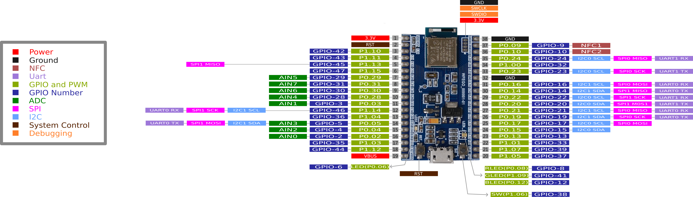

# WFEGO_000001 介紹

## The Pinout of the WFEGO_000001-01
* WFEGO_000001腳位：腳位33根，腳位說明如下圖

## 開發方式
* 支援`Arduino IDE`開發.
* 支援`Nordic SDK`開發.
  * nRF5 SDK(原廠不再更新).
  * nRF Connect SDK.

## 相容
* 與 ESP32 (NodeMCU 32S) 安信可版本 幾乎相容.
  * 需將`P0.05設為Output並輸出Low準位`.
* 與 nRF52840 Dongle 幾乎相容.
  * `CONFIG_BOARD_ENABLE_DCDC_HV=n`

## [nRF52840 原廠資料](https://infocenter.nordicsemi.com/index.jsp?topic=/struct_nrf52/struct/nrf52.html)

## [模組資料](https://www.raytac.com/product/ins.php?index_id=24)

## [教學](./Tutorial/Tutorial.md)

## [Buy From](https://shopee.tw/nRF52840-%E9%96%8B%E7%99%BC%E6%9D%BF-i.26640381.23644275212?sp_atk=af0a1c73-030b-4a82-b1d5-a3a14a383f4f&xptdk=af0a1c73-030b-4a82-b1d5-a3a14a383f4f)