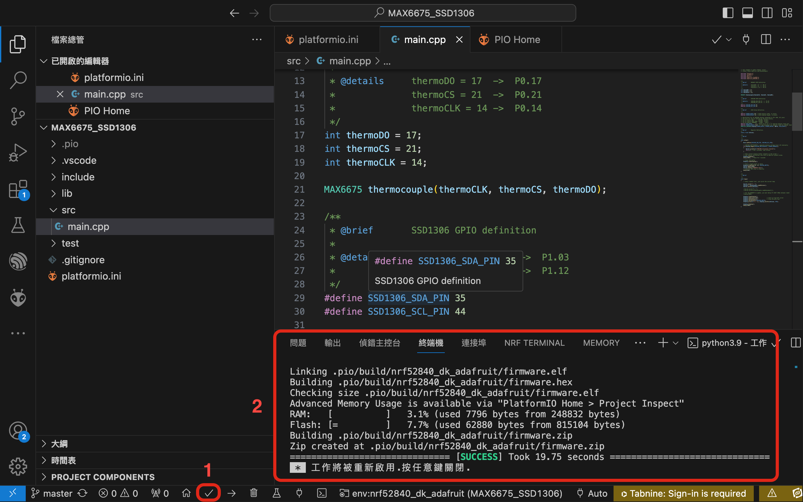
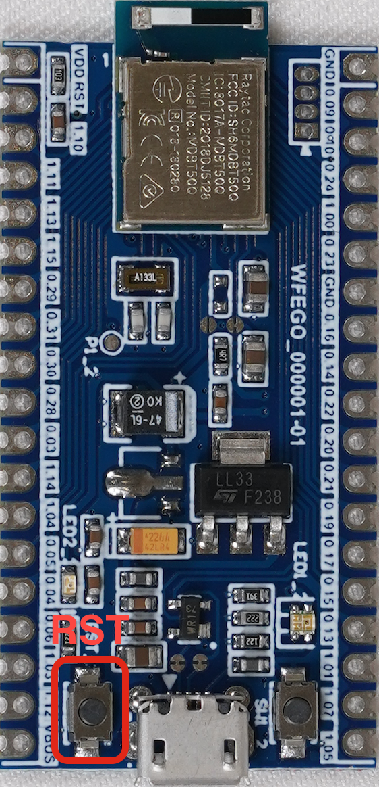
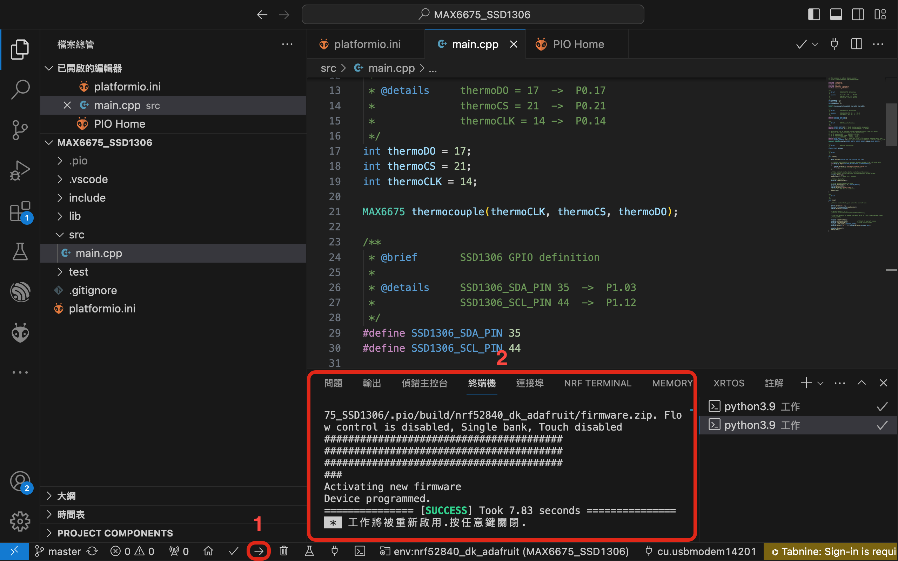
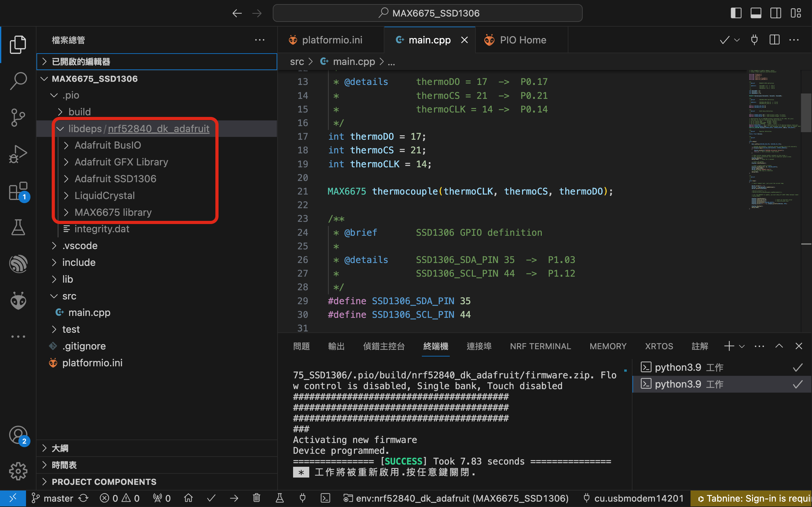

# 專案目的 : 偵測溫度並顯示在OLED

## 開發環境
* Framework : Arduino
* IDE : VSCode + PlatfromIO

## 硬體資訊
* Board : WFEGO-000001
* 溫感測器模組 : [MAX6675](https://www.jmaker.com.tw/products/product261)
* 顯示器 : [SSD1306](https://blog.jmaker.com.tw/arduino-ssd1306-oled/)

## 專案建立
* 點選`PlatformIO圖像`，下圖 1 所指處 -> 點選`Create New Project`，下圖 2 所指處 -> 點選`New Project`，下圖 3 所指處.
  

* Project Wizard
  * Name : 專案名稱.
  * Board : 選擇 `Nordic nRF52840-DK(Adafruit BSP)`.
  * Framework : Arduino.
  * Location : 可選擇預設位置或改變路徑.

* 點選`Finish`.
 

* 專案建置
 
 
 

### 安裝 MAX6675 Libraries
* 點選`PlatformIO Home`，下圖 1 所指處 -> 點選`Libraries`，下圖 2 所指處 -> 搜尋`MAX6675`，下圖 3 所指處 -> 點選`MAX6675 libraries by Adafruit`，下圖 4 所指處
 

* 點選`Installation`，下圖 1 所指處，並複製`lib_deps = adafruit/MAX6675 library@^1.1.2`，下圖 2 所指處.
 

* 開啟專案的`platformio.ini文件`，下圖 1 所指處，將`lib_deps = adafruit/MAX6675 library@^1.1.2`加入platformio.ini，下圖 2 所指處.儲存該檔案.
 

### MAX6675 Library 所提供的範例
* 點選`Examples`, 下圖 1 所指處, 點選`下圖 2 所指處`，可看出這個Library提供那些範例.該專案我們參考`serialthermocouple`範例.
 

## main.cpp 加入 max6675 偵測
### include 相關檔案
* 由於有使用`Serial`, 故需加入`Adafruit_TinyUSB.h`
```c
#include "Arduino.h"
#include "max6675.h"
#include <Adafruit_TinyUSB.h>
``` 
### I/O 修改
* 依據板端所需，修改對應I/O
```c
int thermoDO = 17;
int thermoCS = 21;
int thermoCLK = 14;
```
### 初始化 MAX6675
``` cpp
MAX6675 thermocouple(thermoCLK, thermoCS, thermoDO);
```

### API
```c
// 讀取攝氏溫度.
float Celsius = thermocouple.readCelsius();

// 讀取華氏溫度.
float Fahrenheit = thermocouple.readFahrenheit();
```
### platformio.ini 修改
* 由於serial使用的鮑率為9600 bps，故需修改`monitor_speed = 9600`
* 上傳方式使用`upload_protocol = nrfutil`

### main.cpp 加入 max6675 偵測 完整範例如下
```c
// this example is public domain. enjoy!
// https://learn.adafruit.com/thermocouple/

#include "Arduino.h"
#include "max6675.h"
#include <Adafruit_TinyUSB.h>

/**
 * @brief       MAX6675 GPIO definition
 * 
 * @details     thermoDO = 17  ->  P0.17
 *              thermoCS = 21  ->  P0.21
 *              thermoCLK = 14 ->  P0.14
 */
int thermoDO = 17;
int thermoCS = 21;
int thermoCLK = 14;

MAX6675 thermocouple(thermoCLK, thermoCS, thermoDO);

/**
 * @brief       Register Definition.
*/
static float Celsius;

/**
 * @brief       
 * 
 */
void setup()
{
    Serial.begin(9600); 
    Serial.println("MAX6675 test");
    // wait for MAX chip to stabilize
    delay(500);
}

/**
 * @brief       
 * 
 */
void loop()
{
    // basic readout test, just print the current temp
  
    Serial.print("C = "); 
    Serial.println(thermocouple.readCelsius());
    
    Serial.print("F = ");
    Serial.println(thermocouple.readFahrenheit());
 
    // For the MAX6675 to update, you must delay AT LEAST 250ms between reads!
    delay(1000);
}
```

### 使用Serial Monitor 監看數值
* 點選並確認`COM Port`, 如下圖 1 所指.
* 點選`Serial Monitor`輸出log，如下圖 2 所指.
 

* log訊息如下
 
