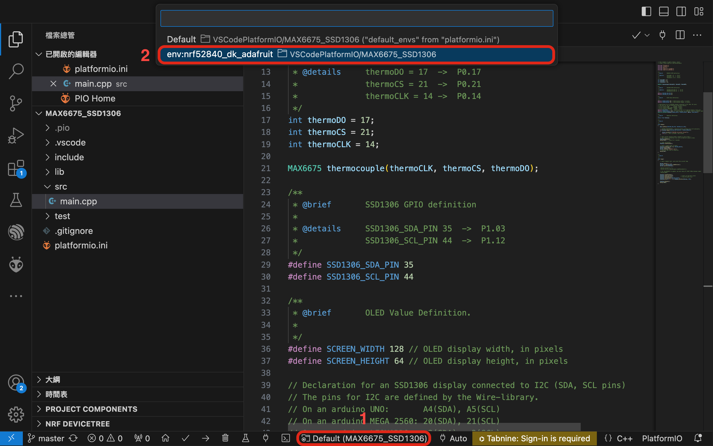
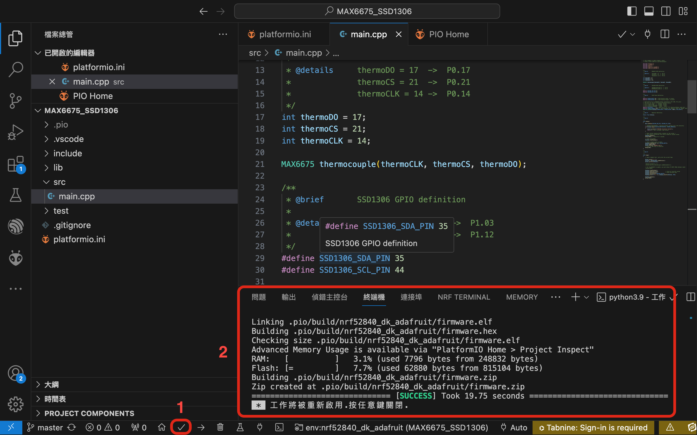
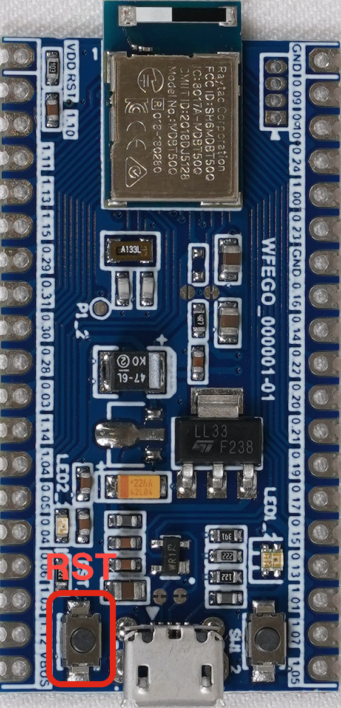
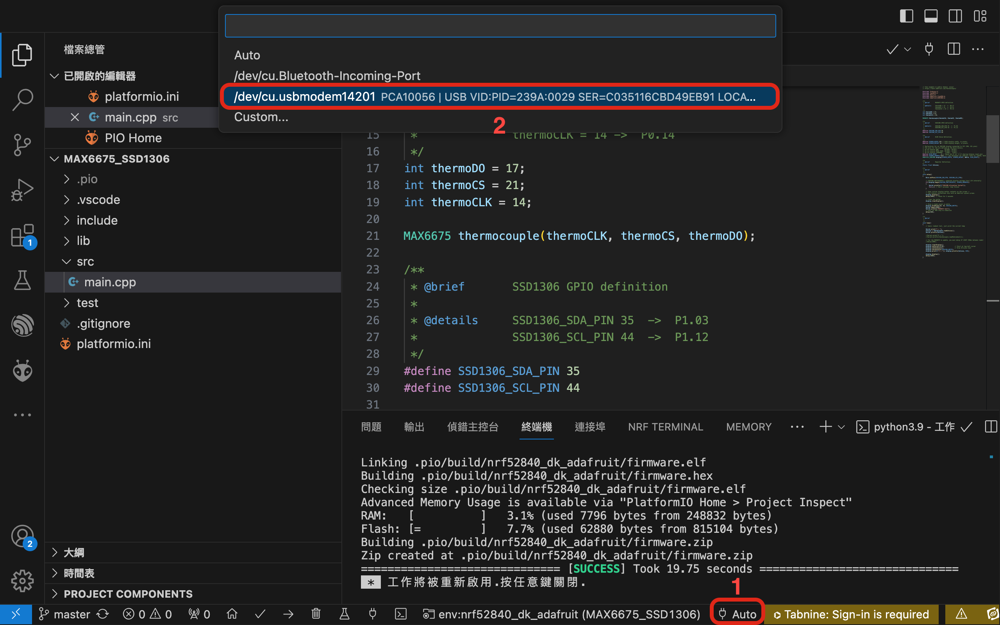
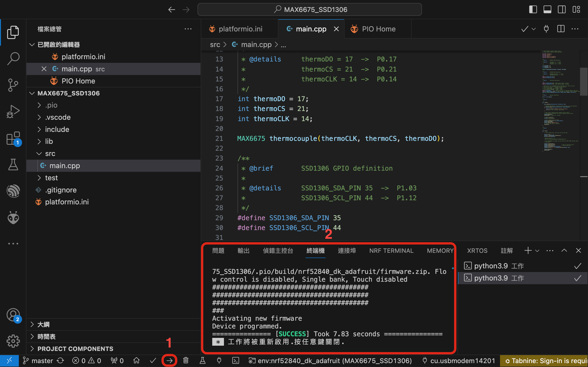
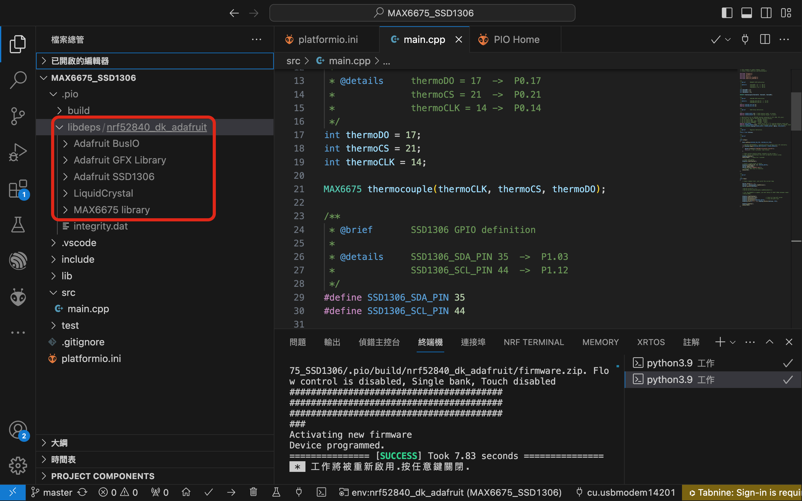

# 專案目的 : 偵測溫度並顯示在OLED

## 開發環境
* Framework : Arduino
* IDE : VSCode + PlatfromIO

## 硬體資訊
* Board : WFEGO-000001
* 溫感測器模組 : [MAX6675](https://www.jmaker.com.tw/products/product261)
* 顯示器 : [SSD1306](https://blog.jmaker.com.tw/arduino-ssd1306-oled/)

## 專案建立

### [移植MAX6675](https://github.com/letter57/WFEGO_000001/blob/main/Tutorial/Arduino/MAX6675/MAX6675.md)

### [移植SSD1306](https://github.com/letter57/WFEGO_000001/blob/main/Tutorial/Arduino/SSD1306/SSD1306.md)


### main.cpp 加入 max6675 偵測 及 ssd1306 顯示，完整範例如下
```c
// this example is public domain. enjoy!
// https://learn.adafruit.com/thermocouple/

#include "Arduino.h"
#include "max6675.h"
#include <Wire.h>
#include <Adafruit_TinyUSB.h>
#include <Adafruit_SSD1306.h>

/**
 * @brief       MAX6675 GPIO definition
 * 
 * @details     thermoDO = 17  ->  P0.17
 *              thermoCS = 21  ->  P0.21
 *              thermoCLK = 14 ->  P0.14
 */
int thermoDO = 17;
int thermoCS = 21;
int thermoCLK = 14;

MAX6675 thermocouple(thermoCLK, thermoCS, thermoDO);

/**
 * @brief       SSD1306 GPIO definition
 * 
 * @details     SSD1306_SDA_PIN 35  ->  P1.03
 *              SSD1306_SCL_PIN 44  ->  P1.12
 */
#define SSD1306_SDA_PIN 35
#define SSD1306_SCL_PIN 44

/**
 * @brief       OLED Value Definition.
 * 
 */
#define SCREEN_WIDTH 128 // OLED display width, in pixels
#define SCREEN_HEIGHT 64 // OLED display height, in pixels

// Declaration for an SSD1306 display connected to I2C (SDA, SCL pins)
// The pins for I2C are defined by the Wire-library. 
// On an arduino UNO:       A4(SDA), A5(SCL)
// On an arduino MEGA 2560: 20(SDA), 21(SCL)
// On an arduino LEONARDO:   2(SDA),  3(SCL), ...
#define OLED_RESET     -1 // Reset pin # (or -1 if sharing Arduino reset pin)
#define SCREEN_ADDRESS 0x3C ///< See datasheet for Address; 0x3D for 128x64, 0x3C for 128x32
Adafruit_SSD1306 display(SCREEN_WIDTH, SCREEN_HEIGHT, &Wire, OLED_RESET);

/**
 * @brief       Register Definition.
*/
static float Celsius;

/**
 * @brief       
 * 
 */
void setup()
{
    Wire.setPins(SSD1306_SDA_PIN, SSD1306_SCL_PIN);

    // SSD1306_SWITCHCAPVCC = generate display voltage from 3.3V internally
    if(!display.begin(SSD1306_SWITCHCAPVCC, SCREEN_ADDRESS))
    {
        Serial.println(F("SSD1306 allocation failed"));
        for(;;); // Don't proceed, loop forever
    }

    // Show initial display buffer contents on the screen --
    // the library initializes this with an Adafruit splash screen.
    display.display();
    delay(2000); // Pause for 2 seconds

    // Clear the buffer
    display.clearDisplay();

    // Draw a single pixel in white
    display.drawPixel(10, 10, SSD1306_WHITE);   
    Serial.begin(9600); 
    Serial.println("MAX6675 test");
    // wait for MAX chip to stabilize
    delay(500);
}

/**
 * @brief       
 * 
 */
void loop()
{
    // basic readout test, just print the current temp
  
    Serial.print("C = "); 
    Celsius = thermocouple.readCelsius();
    Serial.println(Celsius);
    
    //Serial.print("F = ");
    //Serial.println(thermocouple.readFahrenheit());
 
    // For the MAX6675 to update, you must delay AT LEAST 250ms between reads!
    //delay(1000);

    display.clearDisplay();
    display.setCursor(0,20);             // Start at top-left corner  
    display.setTextSize(2);              // Draw 2X-scale text
    display.setTextColor(SSD1306_WHITE);
    display.print(F("C = ")); display.println(Celsius, BIN);

    display.display();
    delay(1000);
}

```
### Swithc PlatformIO Project Environment
* 點選`Swithc PlatformIO Project Environment`，下圖 1 所指處，選擇我們想要的Project Environment`env:nrf52840_dk_adafruit`，下圖 2 所指處，沒有選擇的話，會使用`Default`.
 

### Build
* 點選`Build`，下圖 1 所指處，檢查是否編譯成功，下圖 2 所指處
 

## Upload Firmware
### Enter Bootloader Mode
* 將WFEGO-000001 透過 USB線 連接至電腦.
* `快速按壓RST按鈕兩次`，下圖所指處.   



### Set Upload Port
* 點選`Set Upload Port`，下圖 1 所指之處，選擇欲更新韌體的COM Port，下圖 2 所指之處.


### Upload
* 點選`Upload`，下圖 1 所指之處，檢查是否更新成功，下圖 2 所指之處.


## Note
### 引用的Libraries
* 使用VSCode + PlatformIO 可以很清楚的知道引用了那些Libraries.
* 點選 `.pio` -> `lib_deps/nrf52840_dk_dafruit`.該專案引用了如下的Libraries.
  * Adafruit BusIO
  * Adafruit GFX Library
  * Adafruit SSD1306
  * LiquidCrystal
  * MAX6675 Library


