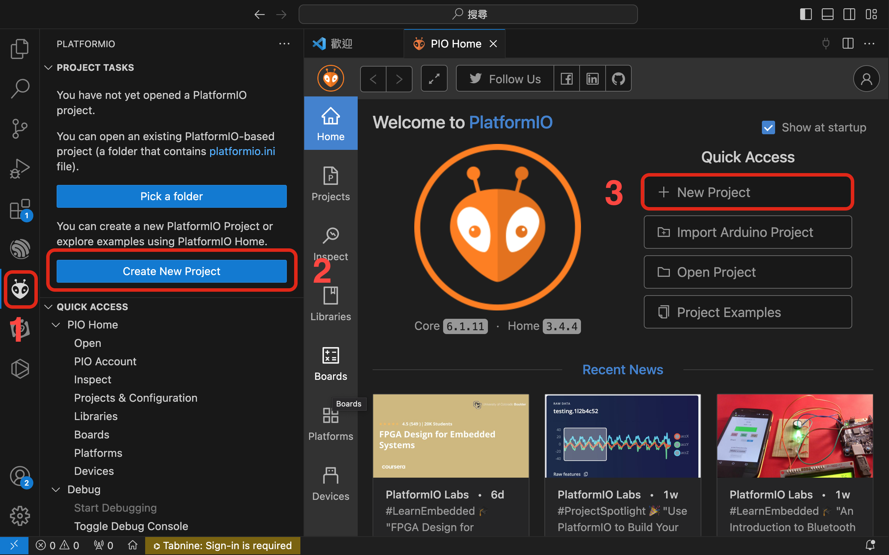
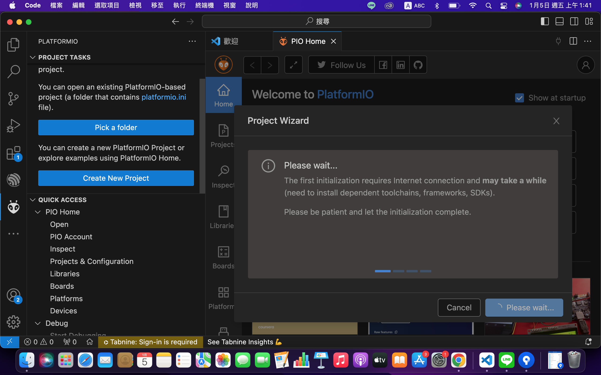
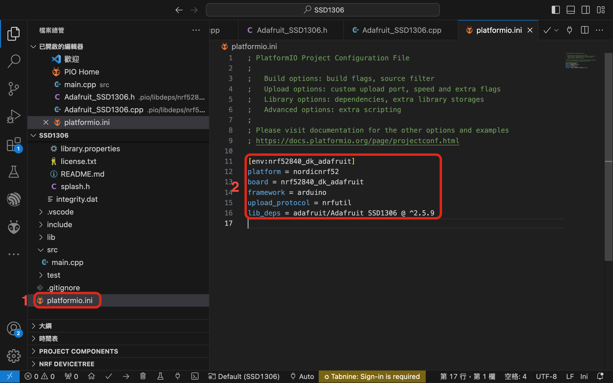

# 專案目的 : OLED顯示

## 開發環境
* Framework : Arduino
* IDE : VSCode + PlatfromIO

## 硬體資訊
* Board : [WFEGO-000001](https://github.com/letter57/WFEGO_000001)
* 顯示器 : [SSD1306](https://blog.jmaker.com.tw/arduino-ssd1306-oled/)

## 專案建立
* 點選`PlatformIO圖像`，下圖 1 所指處 -> 點選`Create New Project`，下圖 2 所指處 -> 點選`New Project`，下圖 3 所指處.
  

* Project Wizard
  * Name : 專案名稱.
  * Board : 選擇 `Nordic nRF52840-DK(Adafruit BSP)`.
  * Framework : Arduino.
  * Location : 可選擇預設位置或改變路徑.

* 點選`Finish`.
 

* 專案建置
 
 
 

### 安裝  Libraries
* 點選`PlatformIO Home`，下圖 1 所指處 -> 點選`Libraries`，下圖 2 所指處 -> 搜尋`SSD1306`，下圖 3 所指處 -> 點選`Adafruit SSD1306 by Adafruit`.
 

* 點選`Installation`，下圖 1 所指處，並複製`lib_deps = adafruit/Adafruit SSD1306 @ ^2.5.9`，下圖 2 所指處.
 

* 開啟專案的`platformio.ini文件`，下圖 1 所指處，將`lib_deps = adafruit/Adafruit SSD1306 @ ^2.5.9`加入platformio.ini，下圖 2 所指處.儲存該檔案.
 

### SSD1306 Library 所提供的範例
* 點選`Examples`, 下圖 1 所指處, 點選`下圖 2 所指處`，可看出這個Library提供那些範例.由於我的ssd1306是128*64，故該專案我們參考`ssd1306_128x64_i2c`範例.
 

## main.cpp 加入 ssd1306 顯示
### include 相關檔案
* 由於有使用`i2c`, 故需加入`Wire.h`
```c
#include <Wire.h>
#include <Adafruit_SSD1306.h>
``` 
### I/O 修改
* 依據板端所需，修改對應I/O
```c
#define SSD1306_SDA_PIN 35
#define SSD1306_SCL_PIN 44
```

### OLED 相關參數定義
```c
#define SCREEN_WIDTH 128 // OLED display width, in pixels
#define SCREEN_HEIGHT 64 // OLED display height, in pixels

// Declaration for an SSD1306 display connected to I2C (SDA, SCL pins)
// The pins for I2C are defined by the Wire-library. 
// On an arduino UNO:       A4(SDA), A5(SCL)
// On an arduino MEGA 2560: 20(SDA), 21(SCL)
// On an arduino LEONARDO:   2(SDA),  3(SCL), ...
#define OLED_RESET     -1 // Reset pin # (or -1 if sharing Arduino reset pin)
#define SCREEN_ADDRESS 0x3C ///< See datasheet for Address; 0x3D for 128x64, 0x3C for 128x32
```
### 初始化 ssd1306
``` cpp
Adafruit_SSD1306 display(SCREEN_WIDTH, SCREEN_HEIGHT, &Wire, OLED_RESET);
```

### platformio.ini 修改
* 上傳方式使用`upload_protocol = nrfutil`
 

### void setup()
* 由於所使用的i2c之 sda_pin 與 scl_pin 與預設的不同，故需依板端做變更.
```c
void setup()
{
    Wire.setPins(SSD1306_SDA_PIN, SSD1306_SCL_PIN);
}
```

### main.cpp 加入 ssd1306 偵測 完整範例如下
```c
#include "Arduino.h"
#include <Wire.h>
#include <Adafruit_SSD1306.h>

/**
 * @brief       SSD1306 GPIO definition
 * 
 * @details     SSD1306_SDA_PIN 35  ->  P1.03
 *              SSD1306_SCL_PIN 44  ->  P1.12
 */
#define SSD1306_SDA_PIN 35
#define SSD1306_SCL_PIN 44

/**
 * @brief       OLED Value Definition.
 * 
 */
#define SCREEN_WIDTH 128 // OLED display width, in pixels
#define SCREEN_HEIGHT 64 // OLED display height, in pixels

// Declaration for an SSD1306 display connected to I2C (SDA, SCL pins)
// The pins for I2C are defined by the Wire-library. 
// On an arduino UNO:       A4(SDA), A5(SCL)
// On an arduino MEGA 2560: 20(SDA), 21(SCL)
// On an arduino LEONARDO:   2(SDA),  3(SCL), ...
#define OLED_RESET     -1 // Reset pin # (or -1 if sharing Arduino reset pin)
#define SCREEN_ADDRESS 0x3C ///< See datasheet for Address; 0x3D for 128x64, 0x3C for 128x32
Adafruit_SSD1306 display(SCREEN_WIDTH, SCREEN_HEIGHT, &Wire, OLED_RESET);

/**
 * @brief       Register Definition.
*/
static float Celsius;

/**
 * @brief   Function definition
*/
void testdrawstyles(void);

/**
 * @brief       
 * 
 */
void setup()
{
    Wire.setPins(SSD1306_SDA_PIN, SSD1306_SCL_PIN);

    // SSD1306_SWITCHCAPVCC = generate display voltage from 3.3V internally
    if(!display.begin(SSD1306_SWITCHCAPVCC, SCREEN_ADDRESS))
    {
        Serial.println(F("SSD1306 allocation failed"));
        for(;;); // Don't proceed, loop forever
    }

    // Show initial display buffer contents on the screen --
    // the library initializes this with an Adafruit splash screen.
    display.display();
    delay(2000); // Pause for 2 seconds
}

/**
 * @brief       
 * 
 */
void loop()
{ 
    testdrawstyles();
}

void testdrawstyles(void) {
  display.clearDisplay();

  display.setTextSize(1);             // Normal 1:1 pixel scale
  display.setTextColor(SSD1306_WHITE);        // Draw white text
  display.setCursor(0,0);             // Start at top-left corner
  display.println(F("Hello, world!"));

  display.setTextColor(SSD1306_BLACK, SSD1306_WHITE); // Draw 'inverse' text
  display.println(3.141592);

  display.setTextSize(2);             // Draw 2X-scale text
  display.setTextColor(SSD1306_WHITE);
  display.print(F("0x")); display.println(0xDEADBEEF, HEX);

  display.display();
  delay(2000);
}
```
### Swithc PlatformIO Project Environment
* 點選`Swithc PlatformIO Project Environment`，下圖 1 所指處，選擇我們想要的Project Environment`env:nrf52840_dk_adafruit`，下圖 2 所指處，沒有選擇的話，會使用`Default`.
 

### Build
* 點選`Build`，下圖 1 所指處，檢查是否編譯成功，下圖 2 所指處
 

## Upload Firmware
### Enter Bootloader Mode
* 將WFEGO-000001 透過 USB線 連接至電腦.
* `快速按壓RST按鈕兩次`，下圖所指處.


### Set Upload Port
* 點選`Set Upload Port`，下圖 1 所指之處，選擇欲更新韌體的COM Port，下圖 2 所指之處.


### Upload
* 點選`Upload`，下圖 1 所指之處，檢查是否更新成功，下圖 2 所指之處.


## Note
### 引用的Libraries
* 使用VSCode + PlatformIO 可以很清楚的知道引用了那些Libraries.
* 點選 `.pio` -> `lib_deps/nrf52840_dk_dafruit`.該專案引用了如下的Libraries.
  * Adafruit BusIO
  * Adafruit GFX Library
  * Adafruit SSD1306


