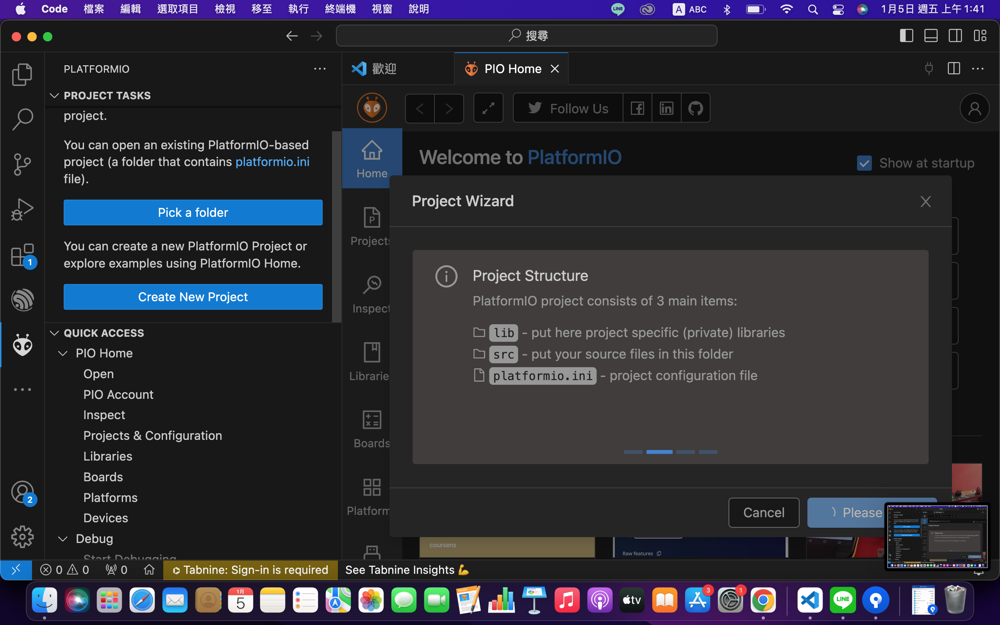

# 專案目的 : ST7789 IPS屏顯示

## 開發環境
* Framework : Arduino
* IDE : VSCode + PlatfromIO

## 硬體資訊
* Board : [WFEGO-000001](https://github.com/letter57/WFEGO_000001)
* 顯示器 : [1.3吋顯示屏ST7789](https://shopee.tw/ST7789-1.3%E5%90%8B-240-x-240-%E8%BF%B7%E4%BD%A065K%E5%85%A8%E5%BD%A9-IPS%E6%B6%B2%E6%99%B6%E8%9E%A2%E5%B9%95-SPI%E9%80%9A%E8%A8%8A-LCD%E9%A1%AF%E7%A4%BA%E5%99%A8-i.26640381.28901773952)

## 專案建立
* 點選`PlatformIO圖像`，下圖 1 所指處 -> 點選`Create New Project`，下圖 2 所指處 -> 點選`New Project`，下圖 3 所指處.
  

* Project Wizard
  * Name : 專案名稱.
  * Board : 選擇 `Nordic nRF52840-DK(Adafruit BSP)`.
  * Framework : Arduino.
  * Location : 可選擇預設位置或改變路徑.

* 點選`Finish`.
 

* 專案建置
 
 
 

### 安裝  Libraries
* 點選`PlatformIO Home`，下圖 1 所指處 -> 點選`Libraries`，下圖 2 所指處 -> 搜尋`ST7789`，下圖 3 所指處 -> 點選`Adafruit ST7735 and ST7789 Library by Adafruit`.
 

* 點選`Add to Project`，下圖 1 所指處.
 

* 選擇這個Lib要加入到那個專案，下圖 1 所指處，點選`Add`，下圖 2 所指處.
 

* 完成如下圖所示.
 

### platformio.ini 修改
* 上傳方式使用`upload_protocol = nrfutil`
 

### ST7789 Library 所提供的範例
* 點選`Examples`, 下圖 3 所指處, 點選`下圖 4 所指處`，可看出這個Library提供那些範例.由於我們使用ST7789，故該專案我們參考`graphicstest_st7789`範例.
 

## 將`graphicstest_st7789`範例 複製到 main.cpp 
 

### I/O 修改
* 依據板端所需，修改對應I/O
```c
#define TFT_CS        22
#define TFT_RST       19 
#define TFT_DC        14
```

### void setup()
* 由於所使用的spi之 uc_pinMISO, uc_pinSCK, uc_pinMOSI 與預設的不同，故需依板端做變更.
```c
void setup()
{
    SPI.setPins(36, 20, 21);
}
```

### main.cpp 加入 ssd1306 偵測 完整範例如下
```c
/**************************************************************************
  This is a library for several Adafruit displays based on ST77* drivers.

  This example works with the 1.14" TFT breakout
    ----> https://www.adafruit.com/product/4383
  The 1.3" TFT breakout
    ----> https://www.adafruit.com/product/4313
  The 1.47" TFT breakout
    ----> https://www.adafruit.com/product/5393
  The 1.54" TFT breakout
    ----> https://www.adafruit.com/product/3787
  The 1.69" TFT breakout
    ----> https://www.adafruit.com/product/5206
  The 1.9" TFT breakout
    ----> https://www.adafruit.com/product/5394
  The 2.0" TFT breakout
    ----> https://www.adafruit.com/product/4311


  Check out the links above for our tutorials and wiring diagrams.
  These displays use SPI to communicate, 4 or 5 pins are required to
  interface (RST is optional).

  Adafruit invests time and resources providing this open source code,
  please support Adafruit and open-source hardware by purchasing
  products from Adafruit!

  Written by Limor Fried/Ladyada for Adafruit Industries.
  MIT license, all text above must be included in any redistribution
 **************************************************************************/

#include <Adafruit_GFX.h>    // Core graphics library
#include <Adafruit_ST7789.h> // Hardware-specific library for ST7789
#include <SPI.h>

#if defined(ARDUINO_FEATHER_ESP32) // Feather Huzzah32
  #define TFT_CS         14
  #define TFT_RST        15
  #define TFT_DC         32

#elif defined(ESP8266)
  #define TFT_CS         4
  #define TFT_RST        16
  #define TFT_DC         5

#else
  // For the breakout board, you can use any 2 or 3 pins.
  // These pins will also work for the 1.8" TFT shield.
#define TFT_CS        22
#define TFT_RST       19 
#define TFT_DC        14
#endif

// OPTION 1 (recommended) is to use the HARDWARE SPI pins, which are unique
// to each board and not reassignable. For Arduino Uno: MOSI = pin 11 and
// SCLK = pin 13. This is the fastest mode of operation and is required if
// using the breakout board's microSD card.

Adafruit_ST7789 tft = Adafruit_ST7789(TFT_CS, TFT_DC, TFT_RST);

// OPTION 2 lets you interface the display using ANY TWO or THREE PINS,
// tradeoff being that performance is not as fast as hardware SPI above.
//#define TFT_MOSI 11  // Data out
//#define TFT_SCLK 13  // Clock out

//Adafruit_ST7789 tft = Adafruit_ST7789(TFT_CS, TFT_DC, TFT_MOSI, TFT_SCLK, TFT_RST);


float p = 3.1415926;

void setup(void) {
  Serial.begin(9600);
  Serial.print(F("Hello! ST77xx TFT Test"));

  SPI.setPins(36, 20, 21);
  // Use this initializer (uncomment) if using a 1.3" or 1.54" 240x240 TFT:
  tft.init(240, 240);           // Init ST7789 240x240

  // OR use this initializer (uncomment) if using a 1.69" 280x240 TFT:
  //tft.init(240, 280);           // Init ST7789 280x240

  // OR use this initializer (uncomment) if using a 2.0" 320x240 TFT:
  //tft.init(240, 320);           // Init ST7789 320x240

  // OR use this initializer (uncomment) if using a 1.14" 240x135 TFT:
  //tft.init(135, 240);           // Init ST7789 240x135
  
  // OR use this initializer (uncomment) if using a 1.47" 172x320 TFT:
  //tft.init(172, 320);           // Init ST7789 172x320

  // OR use this initializer (uncomment) if using a 1.9" 170x320 TFT:
  //tft.init(170, 320);           // Init ST7789 170x320

  // SPI speed defaults to SPI_DEFAULT_FREQ defined in the library, you can override it here
  // Note that speed allowable depends on chip and quality of wiring, if you go too fast, you
  // may end up with a black screen some times, or all the time.
  //tft.setSPISpeed(40000000);
  Serial.println(F("Initialized"));

  uint16_t time = millis();
  tft.fillScreen(ST77XX_BLACK);
  time = millis() - time;

  Serial.println(time, DEC);
  delay(500);

  // large block of text
  tft.fillScreen(ST77XX_BLACK);
  testdrawtext("Lorem ipsum dolor sit amet, consectetur adipiscing elit. Curabitur adipiscing ante sed nibh tincidunt feugiat. Maecenas enim massa, fringilla sed malesuada et, malesuada sit amet turpis. Sed porttitor neque ut ante pretium vitae malesuada nunc bibendum. Nullam aliquet ultrices massa eu hendrerit. Ut sed nisi lorem. In vestibulum purus a tortor imperdiet posuere. ", ST77XX_WHITE);
  delay(1000);

  // tft print function!
  tftPrintTest();
  delay(4000);

  // a single pixel
  tft.drawPixel(tft.width()/2, tft.height()/2, ST77XX_GREEN);
  delay(500);

  // line draw test
  testlines(ST77XX_YELLOW);
  delay(500);

  // optimized lines
  testfastlines(ST77XX_RED, ST77XX_BLUE);
  delay(500);

  testdrawrects(ST77XX_GREEN);
  delay(500);

  testfillrects(ST77XX_YELLOW, ST77XX_MAGENTA);
  delay(500);

  tft.fillScreen(ST77XX_BLACK);
  testfillcircles(10, ST77XX_BLUE);
  testdrawcircles(10, ST77XX_WHITE);
  delay(500);

  testroundrects();
  delay(500);

  testtriangles();
  delay(500);

  mediabuttons();
  delay(500);

  Serial.println("done");
  delay(1000);
}

void loop() {
  tft.invertDisplay(true);
  delay(500);
  tft.invertDisplay(false);
  delay(500);
}

void testlines(uint16_t color) {
  tft.fillScreen(ST77XX_BLACK);
  for (int16_t x=0; x < tft.width(); x+=6) {
    tft.drawLine(0, 0, x, tft.height()-1, color);
    delay(0);
  }
  for (int16_t y=0; y < tft.height(); y+=6) {
    tft.drawLine(0, 0, tft.width()-1, y, color);
    delay(0);
  }

  tft.fillScreen(ST77XX_BLACK);
  for (int16_t x=0; x < tft.width(); x+=6) {
    tft.drawLine(tft.width()-1, 0, x, tft.height()-1, color);
    delay(0);
  }
  for (int16_t y=0; y < tft.height(); y+=6) {
    tft.drawLine(tft.width()-1, 0, 0, y, color);
    delay(0);
  }

  tft.fillScreen(ST77XX_BLACK);
  for (int16_t x=0; x < tft.width(); x+=6) {
    tft.drawLine(0, tft.height()-1, x, 0, color);
    delay(0);
  }
  for (int16_t y=0; y < tft.height(); y+=6) {
    tft.drawLine(0, tft.height()-1, tft.width()-1, y, color);
    delay(0);
  }

  tft.fillScreen(ST77XX_BLACK);
  for (int16_t x=0; x < tft.width(); x+=6) {
    tft.drawLine(tft.width()-1, tft.height()-1, x, 0, color);
    delay(0);
  }
  for (int16_t y=0; y < tft.height(); y+=6) {
    tft.drawLine(tft.width()-1, tft.height()-1, 0, y, color);
    delay(0);
  }
}

void testdrawtext(char *text, uint16_t color) {
  tft.setCursor(0, 0);
  tft.setTextColor(color);
  tft.setTextWrap(true);
  tft.print(text);
}

void testfastlines(uint16_t color1, uint16_t color2) {
  tft.fillScreen(ST77XX_BLACK);
  for (int16_t y=0; y < tft.height(); y+=5) {
    tft.drawFastHLine(0, y, tft.width(), color1);
  }
  for (int16_t x=0; x < tft.width(); x+=5) {
    tft.drawFastVLine(x, 0, tft.height(), color2);
  }
}

void testdrawrects(uint16_t color) {
  tft.fillScreen(ST77XX_BLACK);
  for (int16_t x=0; x < tft.width(); x+=6) {
    tft.drawRect(tft.width()/2 -x/2, tft.height()/2 -x/2 , x, x, color);
  }
}

void testfillrects(uint16_t color1, uint16_t color2) {
  tft.fillScreen(ST77XX_BLACK);
  for (int16_t x=tft.width()-1; x > 6; x-=6) {
    tft.fillRect(tft.width()/2 -x/2, tft.height()/2 -x/2 , x, x, color1);
    tft.drawRect(tft.width()/2 -x/2, tft.height()/2 -x/2 , x, x, color2);
  }
}

void testfillcircles(uint8_t radius, uint16_t color) {
  for (int16_t x=radius; x < tft.width(); x+=radius*2) {
    for (int16_t y=radius; y < tft.height(); y+=radius*2) {
      tft.fillCircle(x, y, radius, color);
    }
  }
}

void testdrawcircles(uint8_t radius, uint16_t color) {
  for (int16_t x=0; x < tft.width()+radius; x+=radius*2) {
    for (int16_t y=0; y < tft.height()+radius; y+=radius*2) {
      tft.drawCircle(x, y, radius, color);
    }
  }
}

void testtriangles() {
  tft.fillScreen(ST77XX_BLACK);
  uint16_t color = 0xF800;
  int t;
  int w = tft.width()/2;
  int x = tft.height()-1;
  int y = 0;
  int z = tft.width();
  for(t = 0 ; t <= 15; t++) {
    tft.drawTriangle(w, y, y, x, z, x, color);
    x-=4;
    y+=4;
    z-=4;
    color+=100;
  }
}

void testroundrects() {
  tft.fillScreen(ST77XX_BLACK);
  uint16_t color = 100;
  int i;
  int t;
  for(t = 0 ; t <= 4; t+=1) {
    int x = 0;
    int y = 0;
    int w = tft.width()-2;
    int h = tft.height()-2;
    for(i = 0 ; i <= 16; i+=1) {
      tft.drawRoundRect(x, y, w, h, 5, color);
      x+=2;
      y+=3;
      w-=4;
      h-=6;
      color+=1100;
    }
    color+=100;
  }
}

void tftPrintTest() {
  tft.setTextWrap(false);
  tft.fillScreen(ST77XX_BLACK);
  tft.setCursor(0, 30);
  tft.setTextColor(ST77XX_RED);
  tft.setTextSize(1);
  tft.println("Hello World!");
  tft.setTextColor(ST77XX_YELLOW);
  tft.setTextSize(2);
  tft.println("Hello World!");
  tft.setTextColor(ST77XX_GREEN);
  tft.setTextSize(3);
  tft.println("Hello World!");
  tft.setTextColor(ST77XX_BLUE);
  tft.setTextSize(4);
  tft.print(1234.567);
  delay(1500);
  tft.setCursor(0, 0);
  tft.fillScreen(ST77XX_BLACK);
  tft.setTextColor(ST77XX_WHITE);
  tft.setTextSize(0);
  tft.println("Hello World!");
  tft.setTextSize(1);
  tft.setTextColor(ST77XX_GREEN);
  tft.print(p, 6);
  tft.println(" Want pi?");
  tft.println(" ");
  tft.print(8675309, HEX); // print 8,675,309 out in HEX!
  tft.println(" Print HEX!");
  tft.println(" ");
  tft.setTextColor(ST77XX_WHITE);
  tft.println("Sketch has been");
  tft.println("running for: ");
  tft.setTextColor(ST77XX_MAGENTA);
  tft.print(millis() / 1000);
  tft.setTextColor(ST77XX_WHITE);
  tft.print(" seconds.");
}

void mediabuttons() {
  // play
  tft.fillScreen(ST77XX_BLACK);
  tft.fillRoundRect(25, 10, 78, 60, 8, ST77XX_WHITE);
  tft.fillTriangle(42, 20, 42, 60, 90, 40, ST77XX_RED);
  delay(500);
  // pause
  tft.fillRoundRect(25, 90, 78, 60, 8, ST77XX_WHITE);
  tft.fillRoundRect(39, 98, 20, 45, 5, ST77XX_GREEN);
  tft.fillRoundRect(69, 98, 20, 45, 5, ST77XX_GREEN);
  delay(500);
  // play color
  tft.fillTriangle(42, 20, 42, 60, 90, 40, ST77XX_BLUE);
  delay(50);
  // pause color
  tft.fillRoundRect(39, 98, 20, 45, 5, ST77XX_RED);
  tft.fillRoundRect(69, 98, 20, 45, 5, ST77XX_RED);
  // play color
  tft.fillTriangle(42, 20, 42, 60, 90, 40, ST77XX_GREEN);
}
```
### Swithc PlatformIO Project Environment
* 點選`Swithc PlatformIO Project Environment`，下圖 1 所指處，選擇我們想要的Project Environment`env:nrf52840_dk_adafruit`，下圖 2 所指處，沒有選擇的話，會使用`Default`.
 

### Build
* 點選`Build`，下圖 1 所指處，檢查是否編譯成功，下圖 2 所指處
 

* 編譯`失敗`，查找編譯失敗原因. `void setup(void)`內所呼叫的函式放在`setup`下面，會造成查找不到，有兩種方式可以解決這個問題.
  * 最簡單的方式是將`setup() & loop()`函式放在main的最底下.   
  如下圖 1 & 2 所指之處.   
  

  * 將setup()函式內所有呼叫的函式，定義在setup()之前.如下圖 1 & 2 所指之處.   
   

## Upload Firmware
### Enter Bootloader Mode
* 將WFEGO-000001 透過 USB線 連接至電腦.
* `快速按壓RST按鈕兩次`，下圖所指處.   


### Set Upload Port
* 點選`Set Upload Port`，下圖 1 所指之處，選擇欲更新韌體的COM Port，下圖 2 所指之處.


### Upload
* 點選`Upload`，下圖 1 所指之處，檢查是否更新成功，下圖 2 所指之處.


## Note
### 調整顯示方向
* 發現顯示方向不對，可使用`tft.setRotation()`調整方向，如下圖 1 所指之處.   


