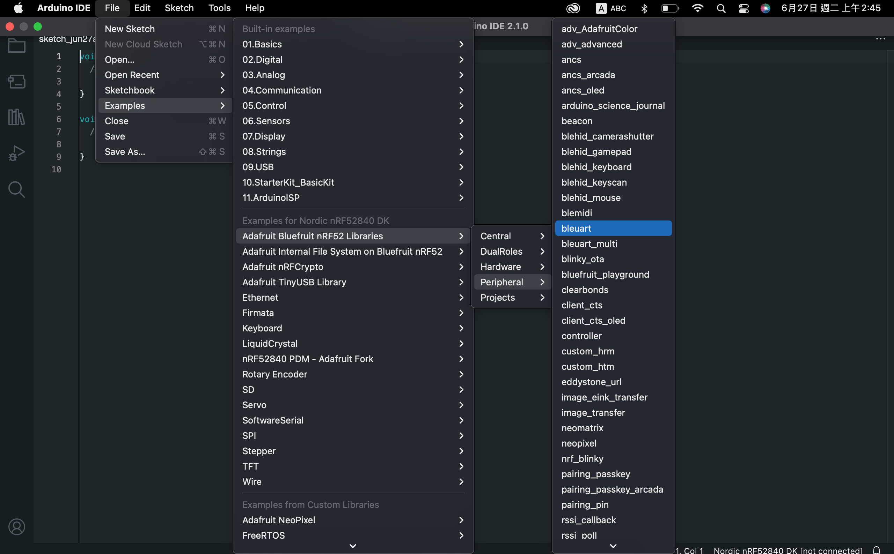
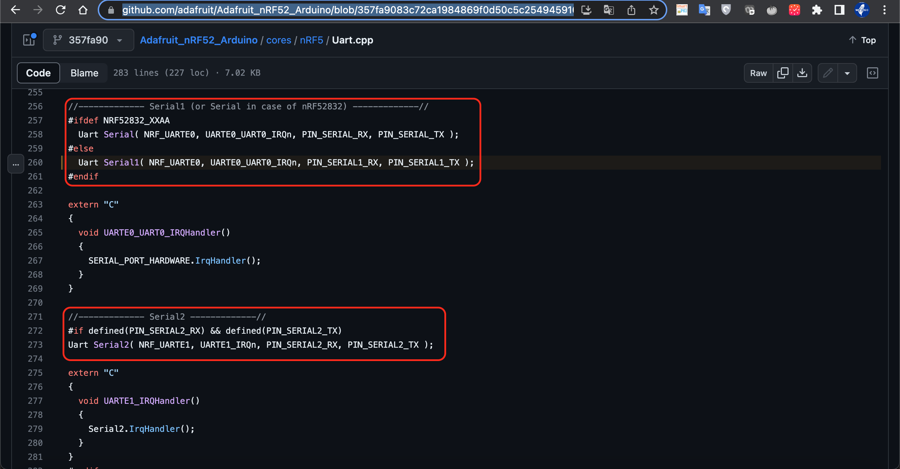
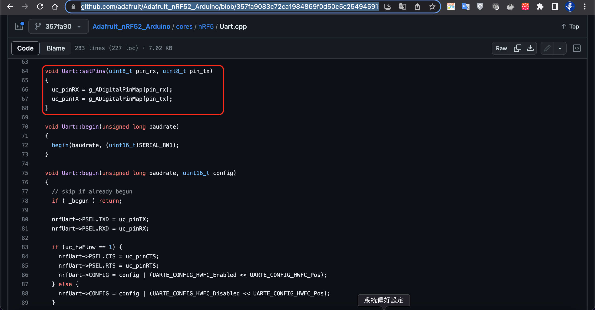
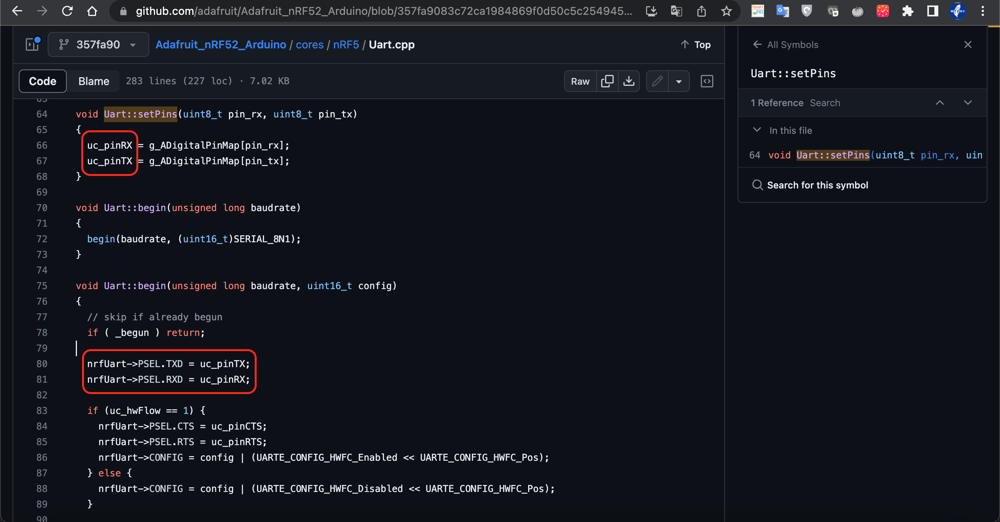
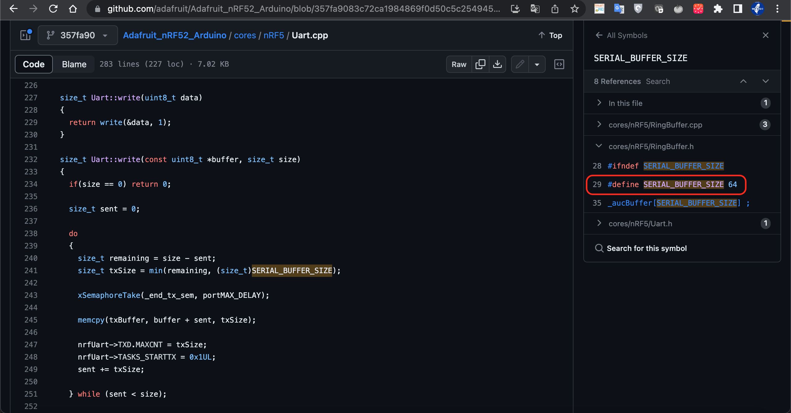

# 專案目的 : 實現透傳功能
## 何謂透傳功能
* A -> WFEGO_000001 -> B   

  * `A` 傳送資料給 `WFEGO_000001`，`WFEGO_000001`收到 `A` 傳來的資料，原封不動的再傳給 `B`.   

* 在此我們使用`UART`來進行通訊.

## WFEGO_000001硬體資訊
* USB * 1
* UART * 2

## 實作   
### File -> Examples -> Adafruit Bluefruit nRF52 Libraries -> Peripheral -> bleuart
   

### 首先來看setup()這個函式.
* Serial : USB

  * 先前有提到過 WFEGO_000001 有一個USB.

  * 所以Serial這個通道預設為USB通道.  


```C
void setup()
{
  Serial.begin(115200);

#if CFG_DEBUG
  // Blocking wait for connection when debug mode is enabled via IDE
  while ( !Serial ) yield();
#endif
  
  Serial.println("Bluefruit52 BLEUART Example");
  Serial.println("---------------------------\n");

  // Setup the BLE LED to be enabled on CONNECT
  // Note: This is actually the default behavior, but provided
  // here in case you want to control this LED manually via PIN 19
  Bluefruit.autoConnLed(true);

  // Config the peripheral connection with maximum bandwidth 
  // more SRAM required by SoftDevice
  // Note: All config***() function must be called before begin()
  Bluefruit.configPrphBandwidth(BANDWIDTH_MAX);

  Bluefruit.begin();
  Bluefruit.setTxPower(4);    // Check bluefruit.h for supported values
  //Bluefruit.setName(getMcuUniqueID()); // useful testing with multiple central connections
  Bluefruit.Periph.setConnectCallback(connect_callback);
  Bluefruit.Periph.setDisconnectCallback(disconnect_callback);

  // To be consistent OTA DFU should be added first if it exists
  bledfu.begin();

  // Configure and Start Device Information Service
  bledis.setManufacturer("Adafruit Industries");
  bledis.setModel("Bluefruit Feather52");
  bledis.begin();

  // Configure and Start BLE Uart Service
  bleuart.begin();

  // Start BLE Battery Service
  blebas.begin();
  blebas.write(100);

  // Set up and start advertising
  startAdv();

  Serial.println("Please use Adafruit's Bluefruit LE app to connect in UART mode");
  Serial.println("Once connected, enter character(s) that you wish to send");
}
```

### 我們的目的是使用UART而不是USB.那如何使用UART呢？從下圖我們得知
* Serial1 : UART0   
* Serial2 : UART1

  

### 設定UART的TX Pin & RX Pin
* 從下圖我們可以使用`setPins(uint8_t pin_rx, uint8_t pin_tx)`這個函式來設定UART的TX Pin & RX Pin
 

### 修改setup()，新增設定UART的TX Pin & RX Pin.

```C
const uint8_t P0_02 = 2;   // pin_rx
const uint8_t P0_03 = 3;   // pin_tx

void setup()
{
  Serial1.setPins(P0_02, P0_03);
  Serial.begin(115200);
}
```

### 如需設定UART的TX Pin & RX Pin時，需在呼叫begin()之前設定好.
 

### 呼叫begin()
```C
const uint8_t P0_02 = 2;   // pin_rx
const uint8_t P0_03 = 3;   // pin_tx

void setup()
{
  Serial1.setPins(P0_02, P0_03);
  Serial1.begin();
  Serial.begin(115200);
}
```

### 修改loop()，實作透傳功能.

```C
void loop()
{
  // Forward data from HW Serial to BLEUART
  while (Serial1.available())
  {
    // Delay to wait for enough input, since we have a limited transmission buffer
    delay(2);

    uint8_t buf[64];
    int count = Serial1.readBytes(buf, sizeof(buf));
    bleuart.write( buf, count );
  }

  // Forward from BLEUART to HW Serial
  while ( bleuart.available() )
  {
    uint8_t ch;
    ch = (uint8_t) bleuart.read();
    Serial1.write(ch);
  }
}
```

### `不管是TX Buffer 還是 RX Buffer，看了一下底層定義的Buffer Size = 64.`
 

### [完整範例](./src/bleuart.ino)
