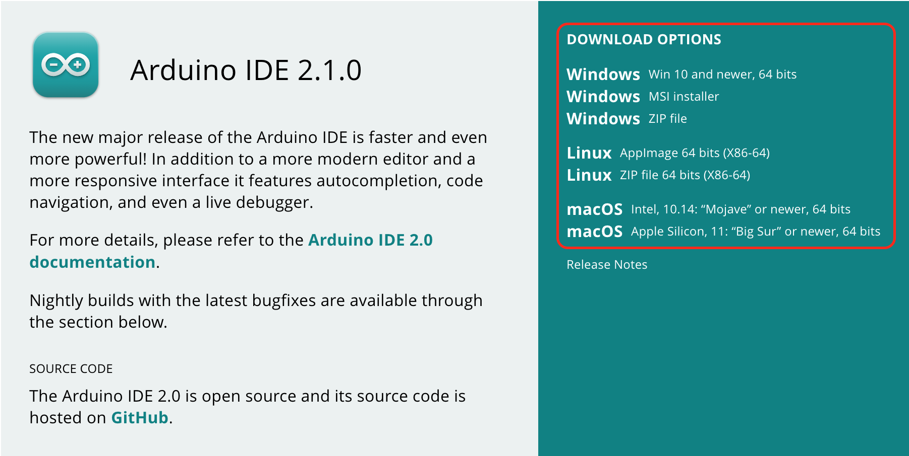
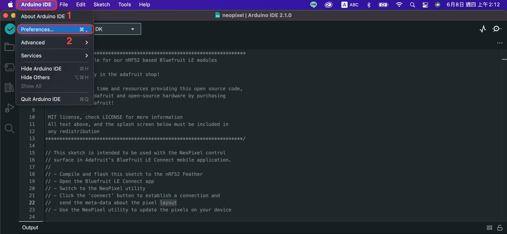
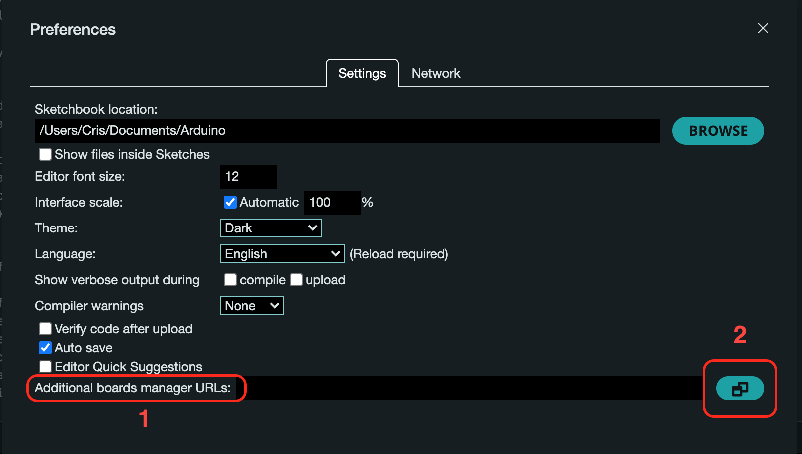
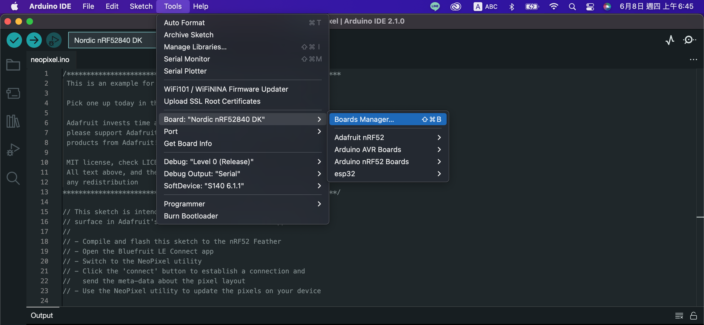
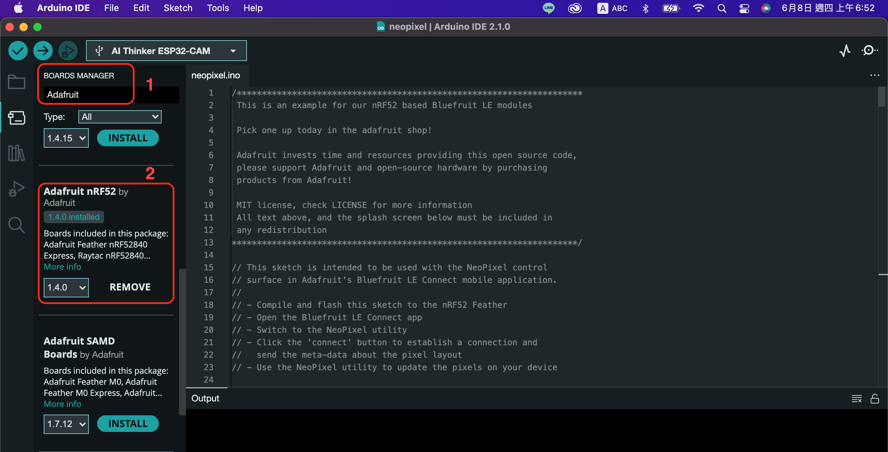
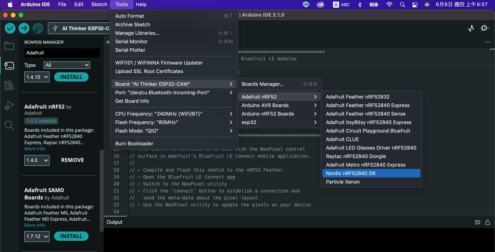
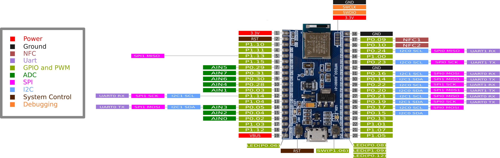
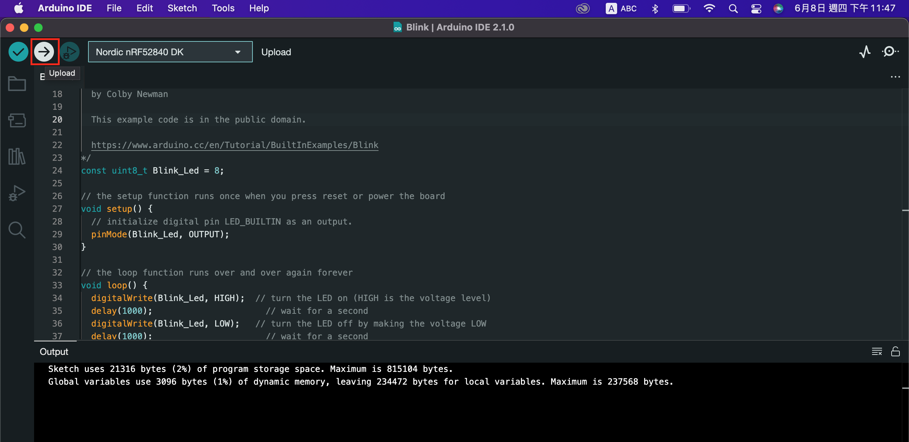

# WFEGO_000001 Arduino開發環境架設

## Arduino IDE 編輯工具安裝
* IDE工具下載： 請至[https://www.arduino.cc/en/Main/Software](https://www.arduino.cc/en/Main/Software) 網站下載.

* 依據所使用作業系統，選擇對應的檔案下載


* 此處點選`JUST DOWNLOAD`，另外一個選項則是捐獻Arduino基金會.


### macOS 作業系統

* 依照作業系統，點選`macOS Intel` or `macOS Apple Silicon`.


* 下載完成後，找到下載的檔案，點擊該檔案.


* 雙擊`Arduino IDE.app` 或將`Arduino IDE.app` 拖曳至 `Application`中.


* 等待安裝結束.

### 安裝核心程式

* 由於WFEGO_000001(nRF52840)是Arduino相容並非Arduino原廠產品，因此必須在Arduino IDE中安裝WFEGO_000001(nRF52840)核心程式，這樣才可使用Arduino IDE寫WFEGO_000001(nRF52840)。

* 點擊`Arduino IDE.app` 


* 點選`Arduino IDE` -> `Preferences...`


* 找到`Additional boards manager URLs`，並將[https://adafruit.github.io/arduino-board-index/package_adafruit_index.json](https://adafruit.github.io/arduino-board-index/package_adafruit_index.json) 新增，然後點擊`OK`.


* 點擊`Tools` -> `Board` -> `Boards Manager`


* 在`BOARDS MANAGER`打上`Adafruit`，然後選擇`Adafruit nRF52`，點擊`INSTALL`


* 完成以上步驟，再次點選`Tools`->`Board`->`Adafruit nRF52`->`Nordic nRF52840 DK`


* 選擇正確的版本後會出現以下畫面


## 程式上傳測試 Blink

### 建立Blink範例並編譯

* 完成環境設定後，就可以來寫程式測試看看.這裡就先用Blink先做個簡單的練習.

* 點選`File`->`Examples`->`01.Basics`->`Blink`


* 完成畫面如下


* 依據WFEGO_000001的Pinout來設定GPIO.在此我們選擇`P0.08` LED燈來做Blink.


```C
/*
  Blink

  Turns an LED on for one second, then off for one second, repeatedly.

  Most Arduinos have an on-board LED you can control. On the UNO, MEGA and ZERO
  it is attached to digital pin 13, on MKR1000 on pin 6. LED_BUILTIN is set to
  the correct LED pin independent of which board is used.
  If you want to know what pin the on-board LED is connected to on your Arduino
  model, check the Technical Specs of your board at:
  https://www.arduino.cc/en/Main/Products

  modified 8 May 2014
  by Scott Fitzgerald
  modified 2 Sep 2016
  by Arturo Guadalupi
  modified 8 Sep 2016
  by Colby Newman

  This example code is in the public domain.

  https://www.arduino.cc/en/Tutorial/BuiltInExamples/Blink
*/
const uint8_t Blink_Led = 8;

// the setup function runs once when you press reset or power the board
void setup() {
  // initialize digital pin LED_BUILTIN as an output.
  pinMode(Blink_Led, OUTPUT);
}

// the loop function runs over and over again forever
void loop() {
  digitalWrite(Blink_Led, HIGH);  // turn the LED on (HIGH is the voltage level)
  delay(1000);                      // wait for a second
  digitalWrite(Blink_Led, LOW);   // turn the LED off by making the voltage LOW
  delay(1000);                      // wait for a second
}
```

* 首先來說明一下，為什麼`P0.08`這支I/O腳，為什麼我們是定義成`uint8_t Blink_Led = 8;`，主要是因為如下的定義.

  * P0.31 = 31
  * P1.00 = 32 

```C
const uint32_t g_ADigitalPinMap[] =
{
  // P0
  0 , 1 , 2 , 3 , 4 , 5 , 6 , 7 ,
  8 , 9 , 10, 11, 12, 13, 14, 15,
  16, 17, 18, 19, 20, 21, 22, 23,
  24, 25, 26, 27, 28, 29, 30, 31,

  // P1
  32, 33, 34, 35, 36, 37, 38, 39,
  40, 41, 42, 43, 44, 45, 46, 47
};

```

* 修改好Blink LED燈的腳位後，讓我們看看編譯的結果吧！！下方圖片為編譯成功的畫面.


### 上傳程式

* `按壓 WFEGO_000001 板的 RST 按鍵兩次`


* 點選`Tools`-> `Port`->Serial Port選擇` Nordic nRF52840 DK` 這個 Serial Port.


* 點選`Upload` 上傳程式碼至WFEGO_000001.


* 成功上傳程式碼至WFEGO_000001畫面如下


* 觀察WFEGO_000001板子上的LED燈狀態.


