# Bluetooth Low Energy Centra 工具

## 將WFEGO_000001連接至電腦 -> 按壓WFEGO_000001的`RST按鍵`，LED2`紅燈閃爍`
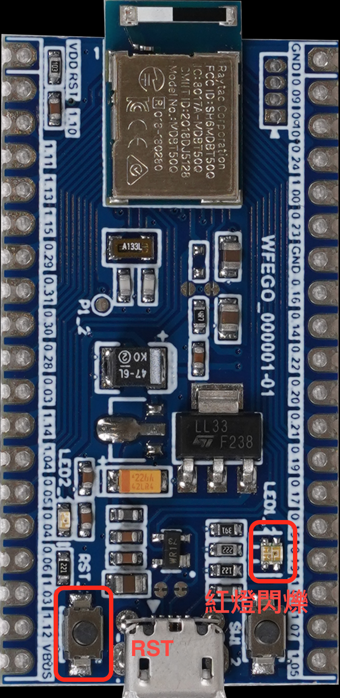

## 開啟nRF Connect for Desktop軟體 -> 選擇 `Bluetooth Low Energy` -> 點選 `OPEN`.
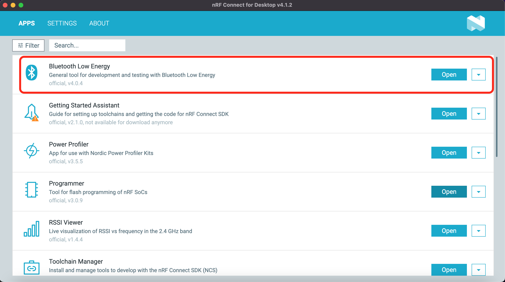

## 出現Bluetooth Low Energy Application Installation, 點擊`Download and Install`.
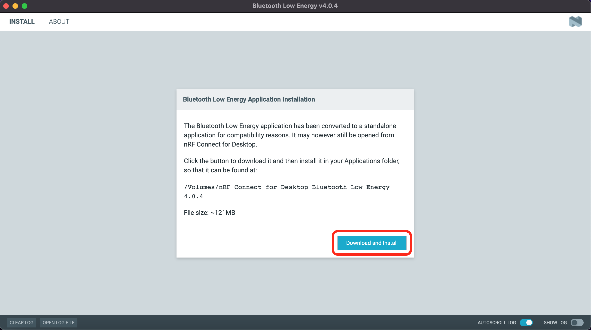

## 雙擊`nRF Connect for Desktop Bluetooth Low Energy.app`
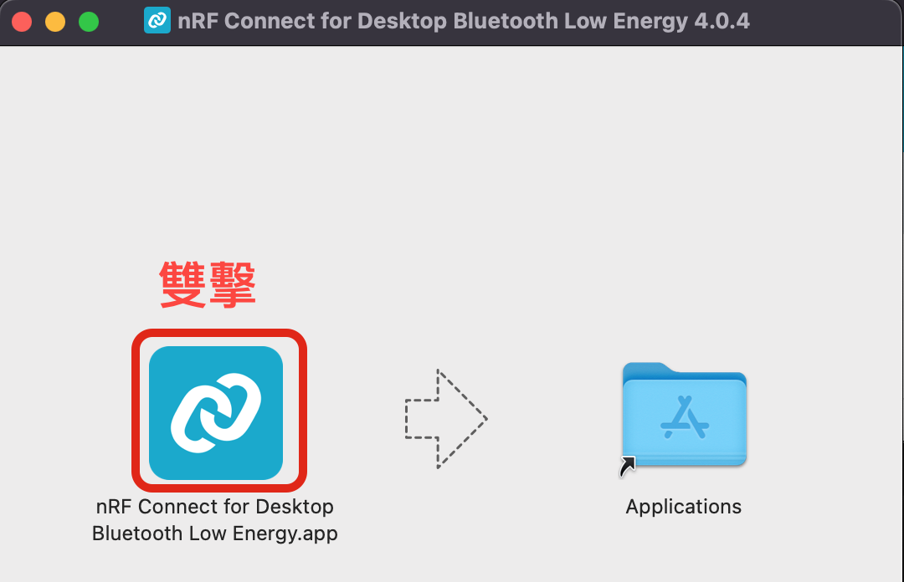

## 點選`SELECT DEVICE`
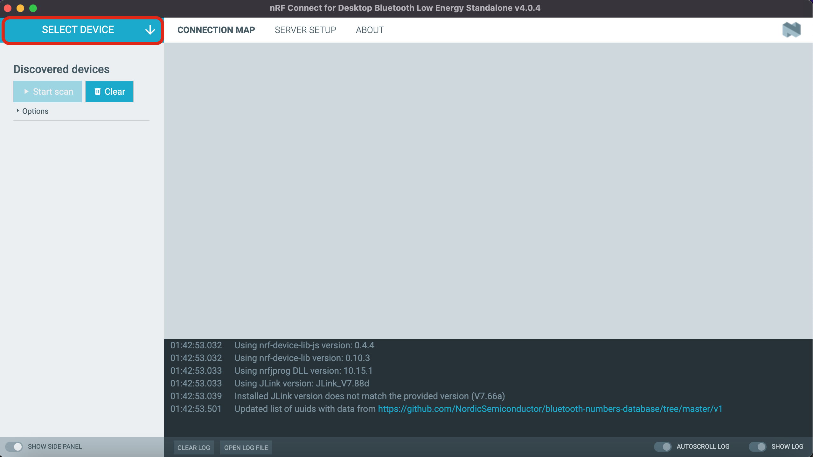

## 點選`Open DFU Bootloader`
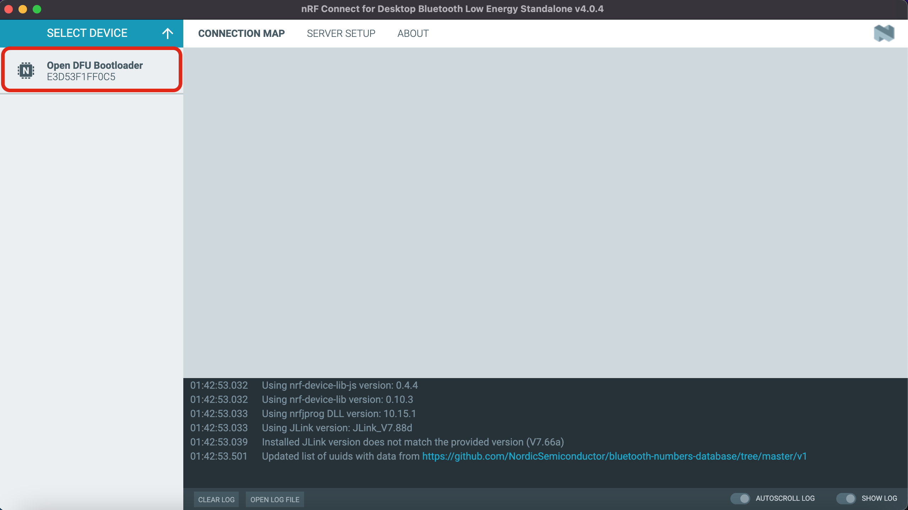

## 出現Device must be programmed, do you want to proceed?視窗，點選`Yes`
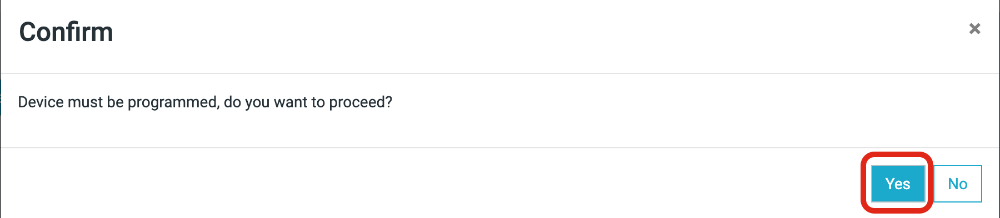

## 現在我們將另一WFEGO_000001燒錄`Nordic_LBS韌體`，燒錄完成後，`LED2持續閃爍`.
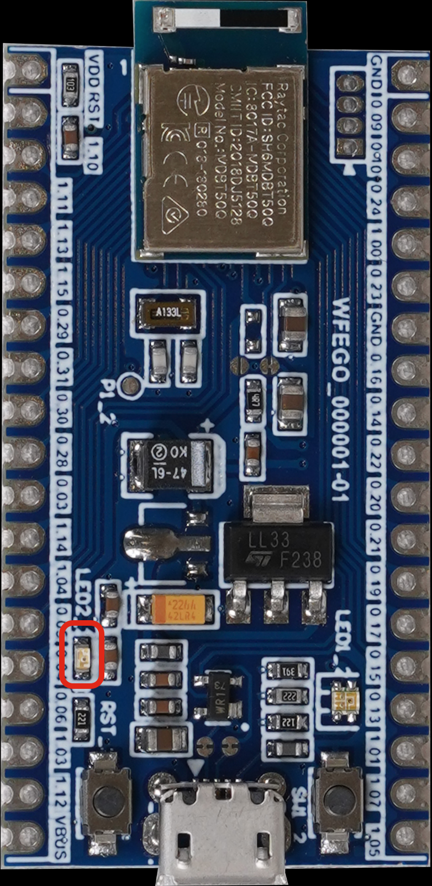

## 點選`Start scan`，即可開始掃描BLE Peripheral.
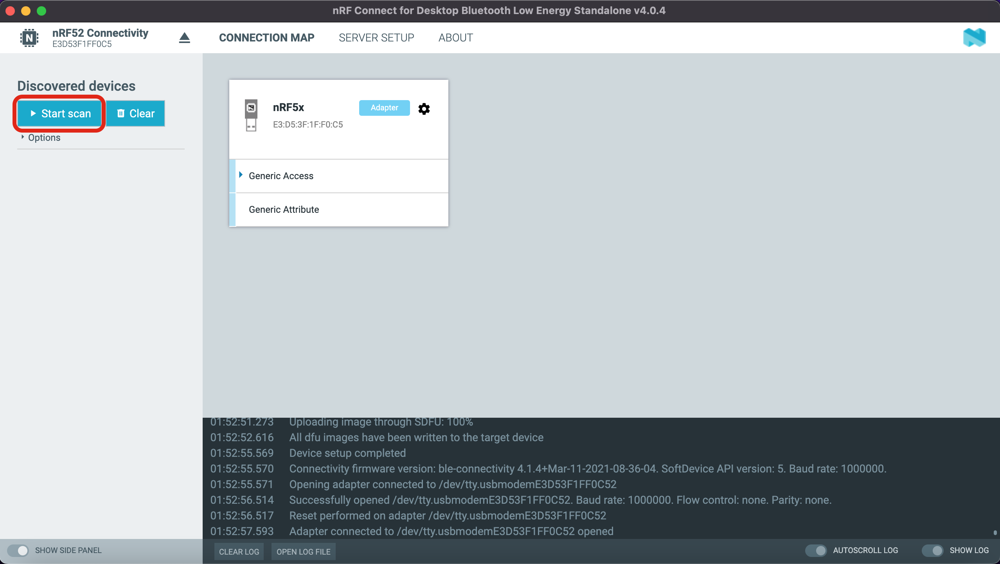

## 現在我們要來操控`Nordic_LBS`這個裝置.點選`Connect`
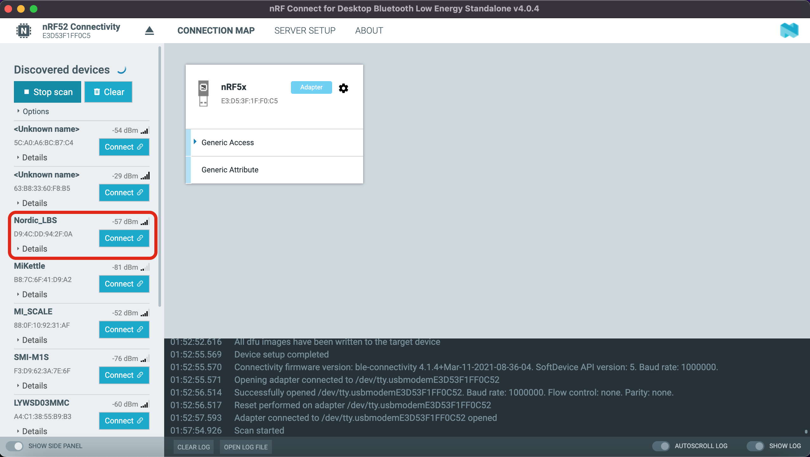

## 成功連接Nordic_LBS裝置後，Nordic_LBS裝置的`LED1會亮起紅燈，表示連線成功.`
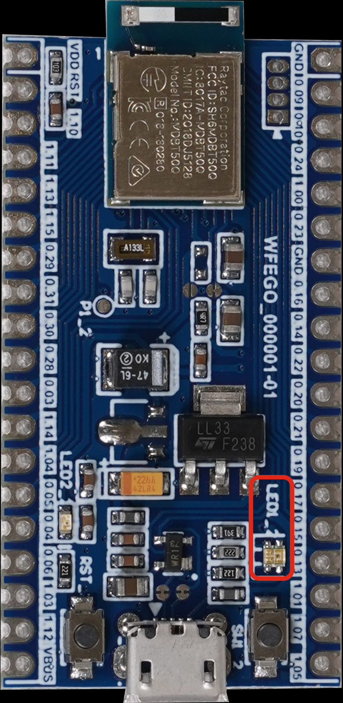

## 點選`Nordic LED and Button Service`
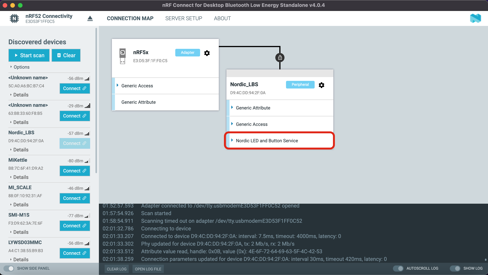

## 控制LED狀態(Blinky LED State)，寫入`01` `Nordic_LBS裝置的LED1綠燈恒亮`.寫入`00` `Nordic_LBS裝置的LED1綠燈熄滅`.
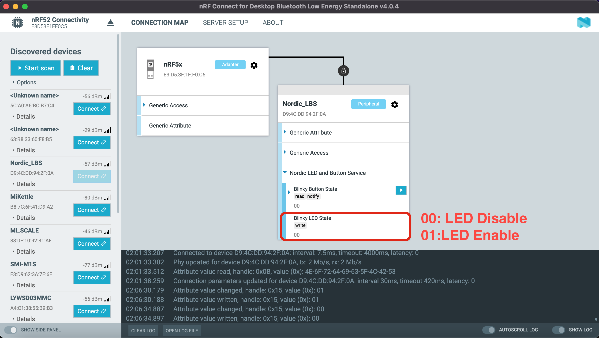

## 監控Button狀態(Blinky Button State)，點選`notify`以便得知Button狀態.
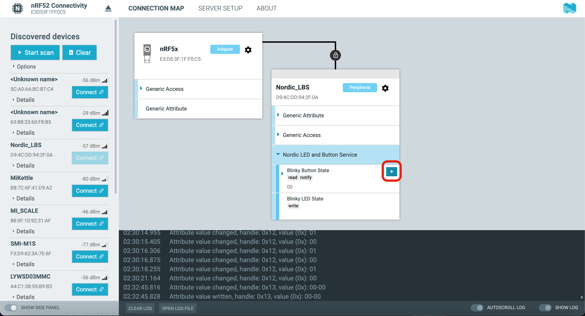

## 按壓Nordic_LBS裝置的SW
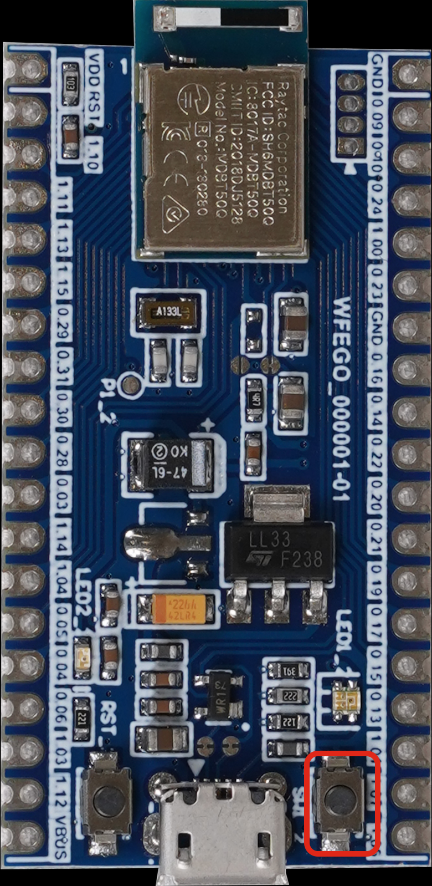

## 觀察視窗Button狀態.
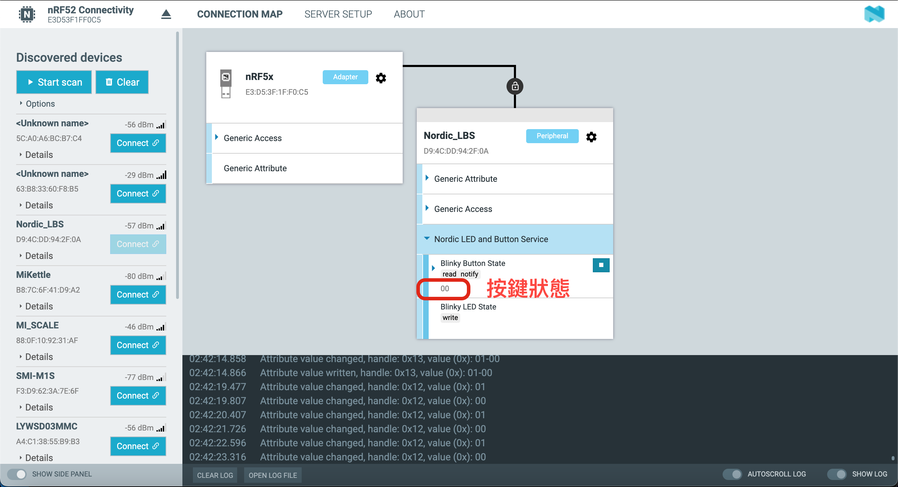
