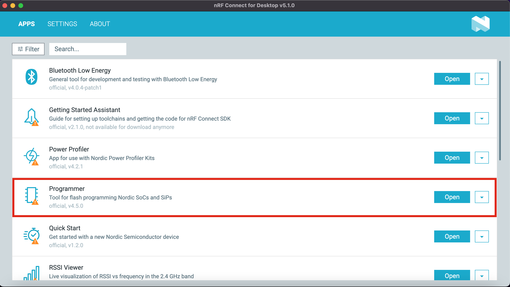
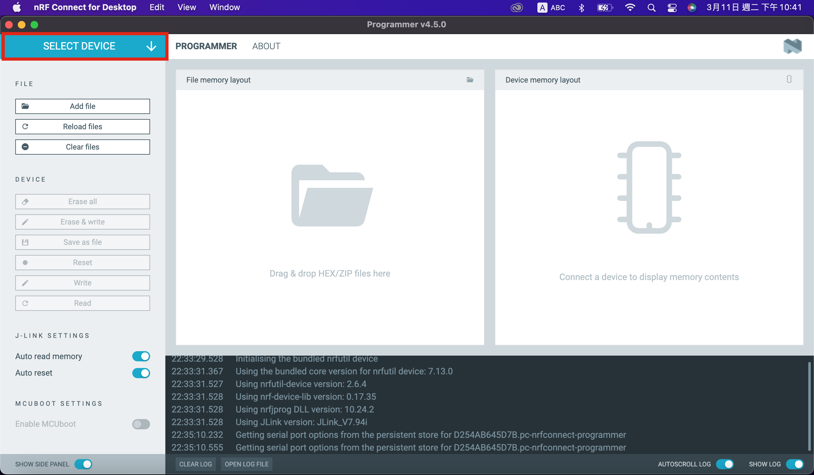
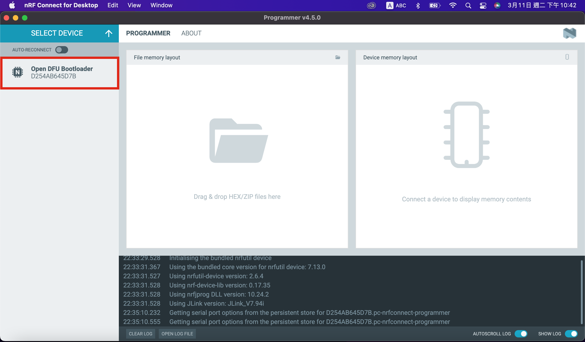
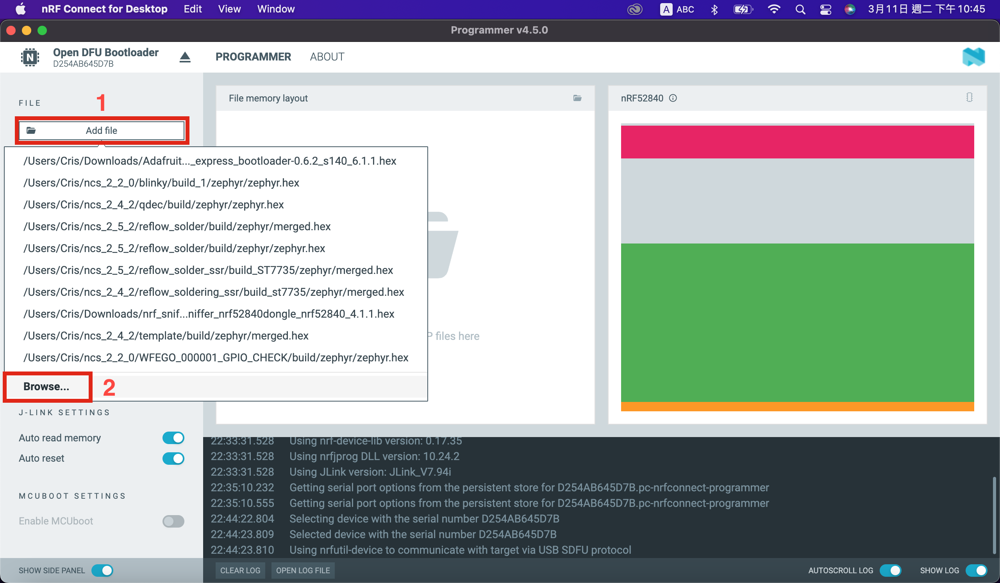
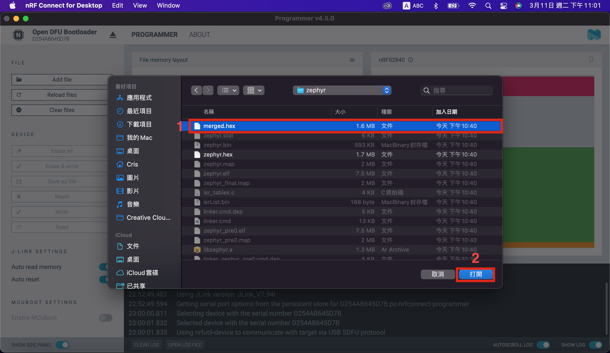
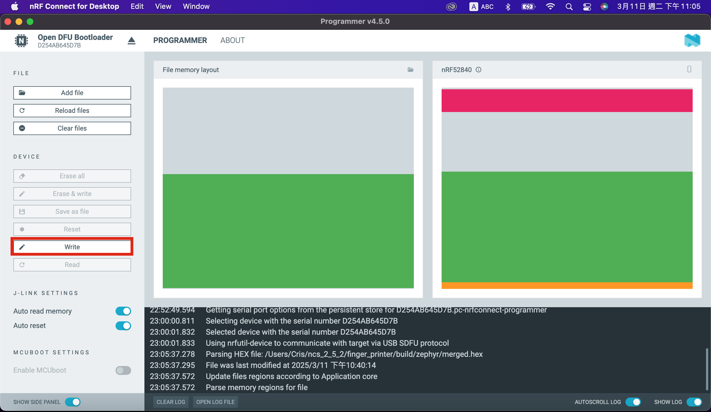
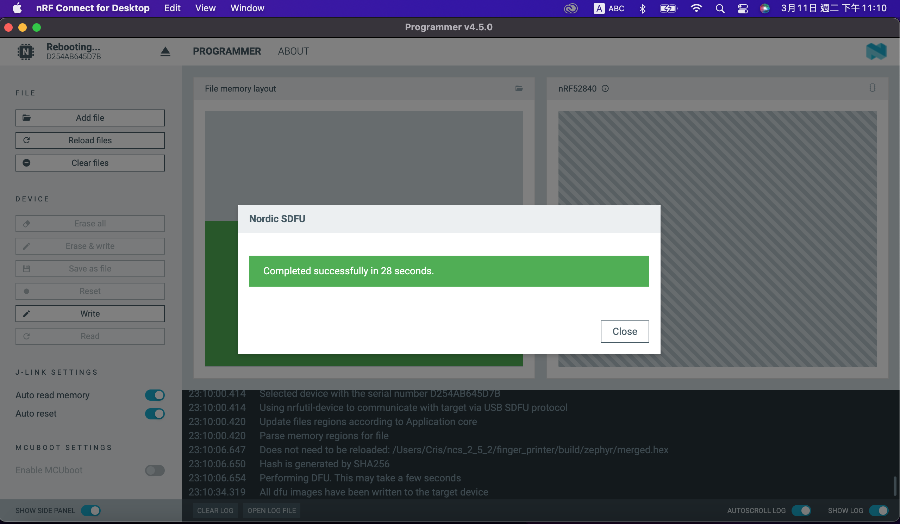

# Programmer 工具

## 將WFEGO_000001連接至電腦 -> 按壓WFEGO_000001的`RST按鍵`，LED1`紅燈閃爍`

## 開啟nRF Connect for Desktop軟體 -> 選擇 `Programmer` -> 點選 `Open`.

## 點選`SELECT DEVICE`

## 點選`Open DFU Bootloader`
   

## 點選`Add file`，如下圖 1 所指處. 點選`Browse`，如下圖 2 所指處.
   

## 點選欲燒錄的`*.hex`檔，如下圖 1 所指處. 選擇完畢後，點選 `打開`，如下圖 2 所指處.   
   

## 點選`Write`，如下圖所示.   
   

## 燒錄完成畫面，如下圖所示.   
   