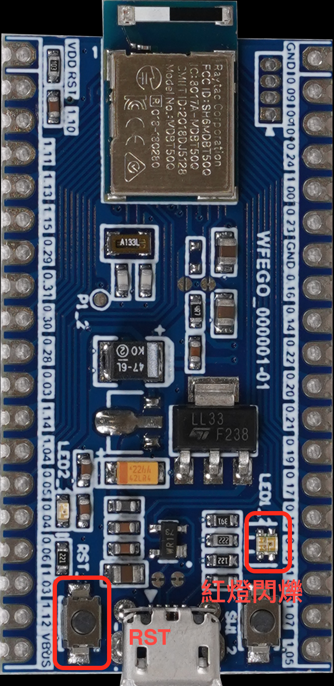
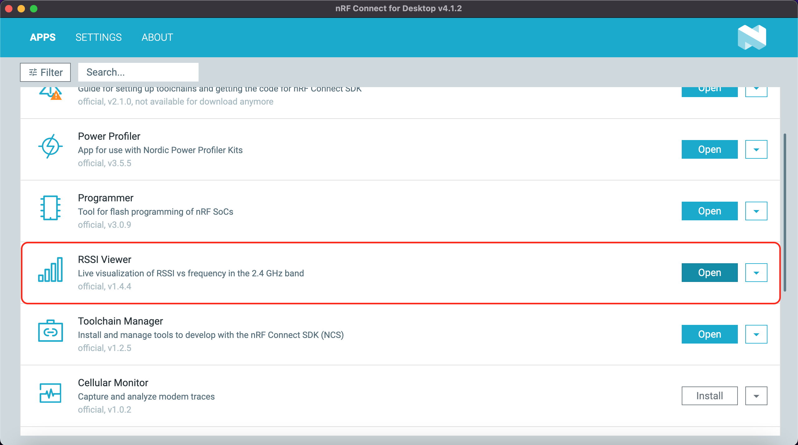
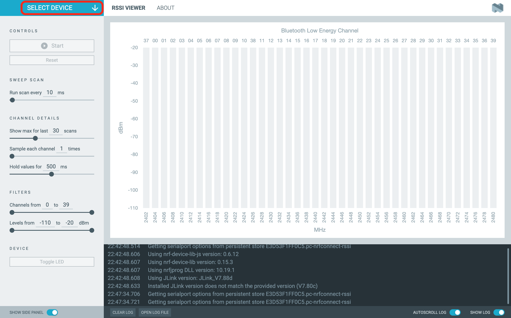
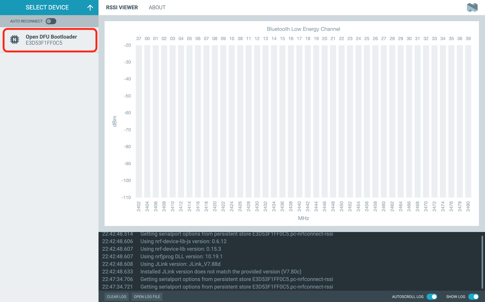
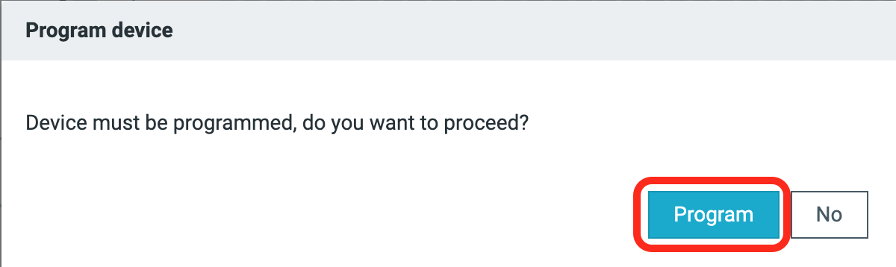
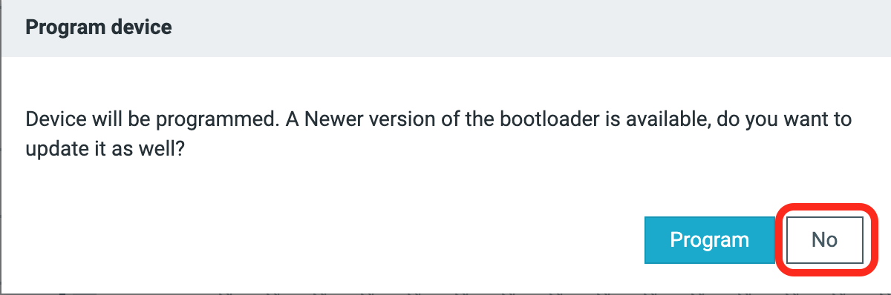
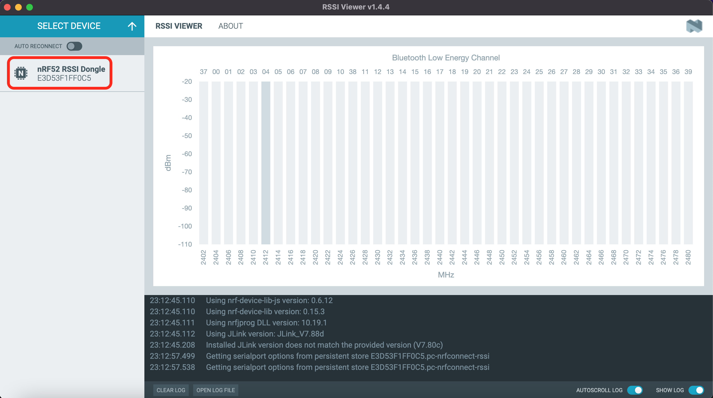
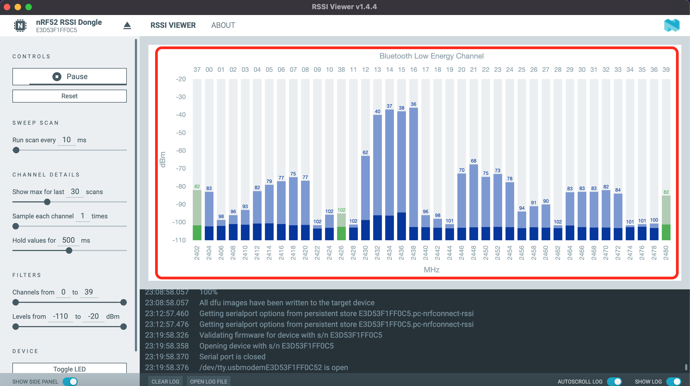

# RSSI Viewer工具

## 將WFEGO_000001連接至電腦 -> 按壓WFEGO_000001的`RST按鍵`，LED2`紅燈閃爍`

## 開啟nRF Connect for Desktop軟體 -> 選擇 `RSSI Viewer` -> 點選 `OPEN`.

## 點選`SELECT DEVICE`

## 點選`Open DFU Bootloader`

## 點選`Program`

## 出現 Device will be programmed. A Newer version of the bootloader is available, do you want to update is as well? 視窗. 點選`No`.

## Plug Out MicroUSB Wire -> Plug in MicroUSB Wire.

## 點選`SELECT DEVICE` -> 點選`nRF52 RSSI Dongle`

## 出現如下畫面，即可觀察 2.4G 各個Channel的dBm.
