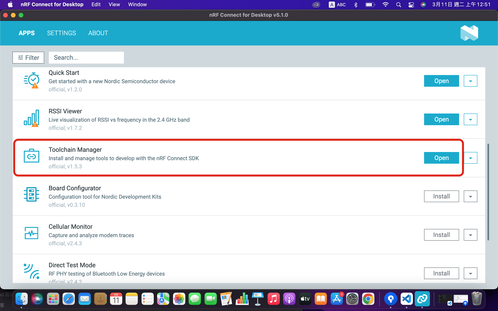
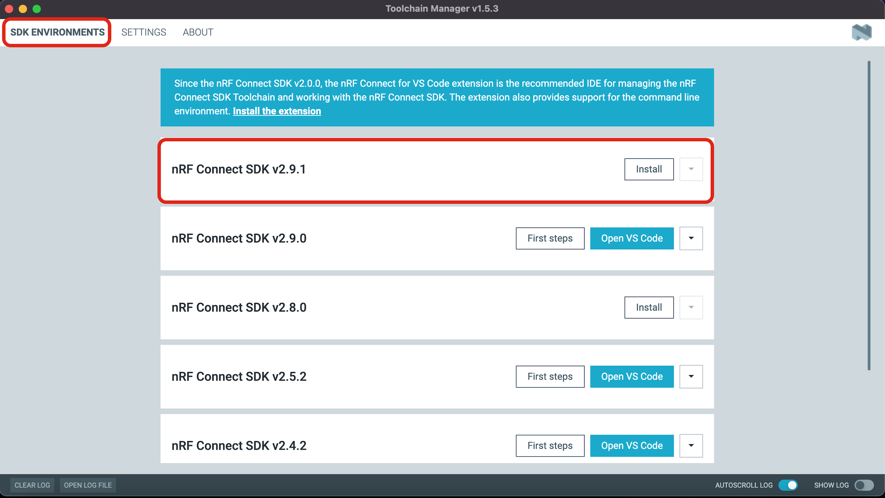
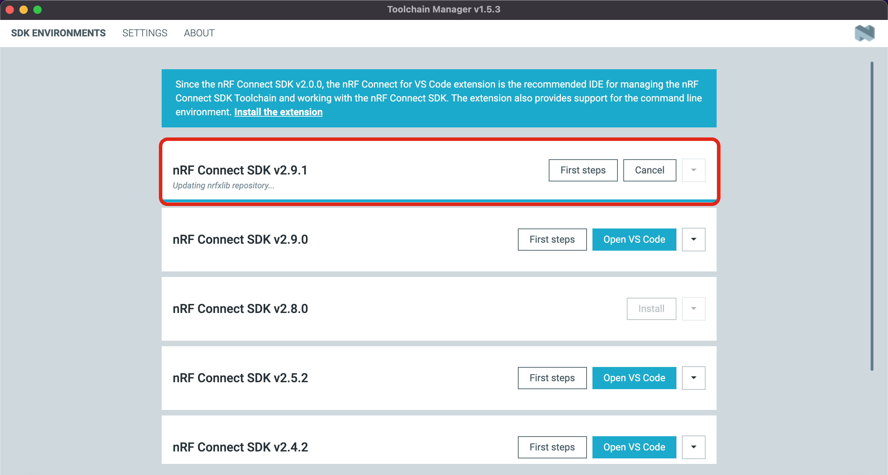
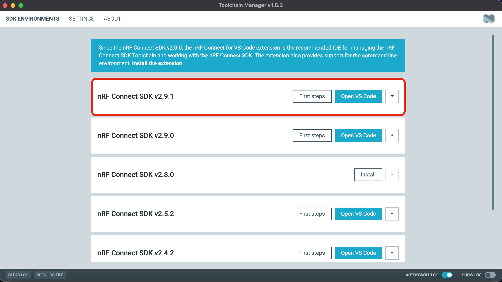

# Toolchain Manager
  * Install and manager tools to develop with the nRF Connect SDK.

## 開啟nRF Connect for Desktop軟體 -> 選擇 `Toolchain Manager` -> 點選 `Open`.如尚未安裝,則會出現`Install`,而非`Open`.則先點選`Install`進行安裝.

## 選擇所需的版本, 先點選`SDK ENVIRONMENTS`在此我們選擇`nRF Connect SDK v2.9.1` -> 點選`Install`.

## 等待安裝完成.安裝過程如下畫面.

## 安裝完成畫面如下.

## 參考文獻   
* [nRF Connect for VS Code, part 1: Installation](https://www.youtube.com/watch?v=EAJdOqsL9m8&list=PLx_tBuQ_KSqEt7NK-H7Lu78lT2OijwIMl)

* [nRF Connect for VS Code, part 2: Creating an application](https://www.youtube.com/watch?v=T4RfflybIGE&list=PLx_tBuQ_KSqEt7NK-H7Lu78lT2OijwIMl&index=2)

* [nRF Connect for VS Code, part 3: Building an application](https://www.youtube.com/watch?v=N1kDSMBtQ2U&list=PLx_tBuQ_KSqEt7NK-H7Lu78lT2OijwIMl&index=3)

* [nRF Connect for VS Code, part 4: Flashing an application](https://www.youtube.com/watch?v=qjVvfU6ShUU&list=PLx_tBuQ_KSqEt7NK-H7Lu78lT2OijwIMl&index=4)

* [nRF Connect for VS Code, part 5: Debugging](https://www.youtube.com/watch?v=IDC2m91xMb0&list=PLx_tBuQ_KSqEt7NK-H7Lu78lT2OijwIMl&index=5)

* [nRF Connect for VS Code, part 6: Changing SDK- and toolchain versions](https://www.youtube.com/watch?v=6L8-25Nt7y8&list=PLx_tBuQ_KSqEt7NK-H7Lu78lT2OijwIMl&index=6)